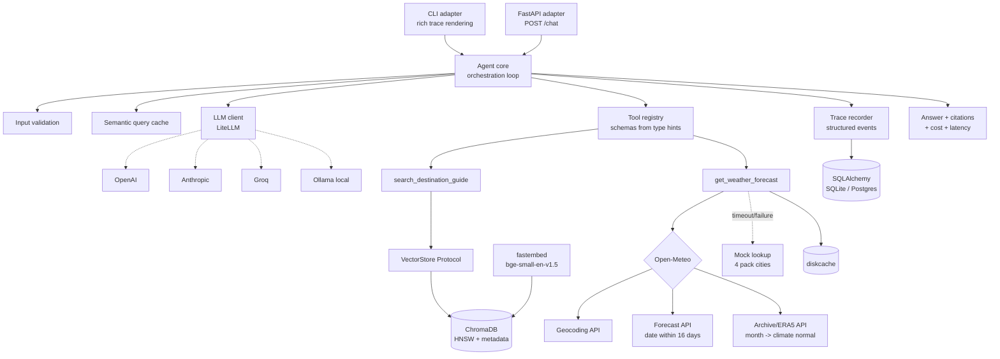

# TripMate

An agentic AI travel assistant that answers natural-language questions about four
destinations — Tokyo, Reykjavik, Bangkok, Barcelona — covering visa requirements,
weather, packing advice, safety, and local customs. The agent decides which tools to
call per query via LLM function-calling, not a keyword router or a fixed script, calls
them in the right order (including both tools together for packing questions), and
emits a visible, replayable reasoning trace for every turn.



## 2. Quickstart

```bash
git clone <repo> && cd tripmate
uv venv && uv pip install -e ".[dev]"
cp .env.example .env        # set LLM_MODEL and LLM_API_KEY

uv run tripmate-ingest      # loads 20 chunks into ChromaDB
uv run tripmate             # CLI
uv run uvicorn tripmate.adapters.api:app --reload   # API at :8000/docs

docker build -t tripmate . && docker run -p 8000:8000 --env-file .env tripmate
```

Both console scripts (`tripmate`, `tripmate-ingest`) are registered in
`[project.scripts]` in `pyproject.toml` and were verified to exist there before being
documented here.

**No API key required.** Set `LLM_MODEL=ollama/qwen3.5` and leave `LLM_API_KEY` empty —
`config.py` treats `ollama`/`ollama_chat` as keyless providers and skips the key check
entirely. This is the same code path as every other provider; only the model string
changes. Running Qwen locally needs roughly 8 GiB of free RAM for Ollama to load the
model — on a machine without that headroom (this development machine included, at 2.8
GiB free against qwen3.5's 7.9 GiB requirement), use a hosted provider instead
(`gpt-4o-mini`, `anthropic/claude-haiku-4-5`, `groq/llama-3.3-70b-versatile`) with
`LLM_API_KEY` set.

## 3. Architecture

Full diagram, request-flow trace, and a paragraph per component (with the file it lives
in) are in [`docs/architecture.md`](docs/architecture.md).

In short: both adapters (CLI, FastAPI) call into one `Agent` built by
`bootstrap.build_agent()`. A query is validated, checked against a semantic cache, then
sent to the LLM with the tool registry's schemas. If the model requests tools, they run
concurrently, results go back as tool messages, and the loop repeats (capped at
`MAX_TOOL_ITERATIONS`) until the model returns a final answer. Citations are validated
against chunks actually retrieved that turn before the answer is returned.

## 4. Tool schemas as given to the LLM

Real output of:

```bash
uv run python -c "
import json
from tripmate.tools.registry import ToolRegistry
from tripmate.tools.destination import search_destination_guide
from tripmate.tools.weather import get_weather_forecast
r = ToolRegistry(); r.register(search_destination_guide); r.register(get_weather_forecast)
print(json.dumps(r.schemas(), indent=2))"
```

```json
[
  {
    "type": "function",
    "function": {
      "name": "search_destination_guide",
      "description": "Search the destination knowledge base for visa, weather-season, customs, packing and safety guidance.",
      "parameters": {
        "properties": {
          "query": {
            "description": "The travel question or topic, e.g. 'visa requirements' or 'what to pack'.",
            "type": "string"
          },
          "city": {
            "anyOf": [
              { "type": "string" },
              { "type": "null" }
            ],
            "default": null,
            "description": "Destination city to restrict the search to. One of: tokyo, reykjavik, bangkok, barcelona. Omit when the question is not about a specific city."
          }
        },
        "required": ["query"],
        "type": "object"
      }
    }
  },
  {
    "type": "function",
    "function": {
      "name": "get_weather_forecast",
      "description": "Get the expected weather for a city on a specific date or during a given month.",
      "parameters": {
        "properties": {
          "city": {
            "description": "City name, e.g. 'Tokyo'.",
            "type": "string"
          },
          "date_or_month": {
            "description": "An ISO date like '2026-12-25' for near-term forecasts, or a month name like 'December' for typical seasonal conditions.",
            "type": "string"
          }
        },
        "required": ["city", "date_or_month"],
        "type": "object"
      }
    }
  }
]
```

There is no hand-written schema anywhere in the codebase — `tools/registry.py` derives
both the schema and the pydantic argument-validation model from each function's type
hints and `Annotated` descriptions, so the signature and the schema the LLM sees cannot
drift apart.

## 5. Example runs

Five real interactions, captured with `LLM_MODEL=groq/openai/gpt-oss-120b`. Full
event-by-event traces are committed as JSONL in `traces/`.

| Trace file | Query | Tools called | Events |
|---|---|---|---|
| `example_single_tool_rag.jsonl` | Do I need a visa to visit Japan as a tourist? | `search_destination_guide` | 6 |
| `example_single_tool_weather.jsonl` | How cold does Reykjavik get in January? | `get_weather_forecast` | 7 |
| `example_multi_tool_packing.jsonl` | What should I pack for Tokyo in December? | **both tools** | 9 |
| `example_out_of_scope.jsonl` | Can you book my flight to Barcelona? | none | 3 |
| `example_weather_fallback.jsonl` | Packing query with the weather API unreachable | both, weather degraded | 9 |

**Multi-tool (the case Module 4 grades).** The packing query calls both tools in one
turn and cites the guide:

```
TOOL_CALL    search_destination_guide  {"query": "packing tips", "city": "tokyo"}
TOOL_CALL    get_weather_forecast      {"city": "Tokyo", "date_or_month": "December"}
TOOL_RESULT  search_destination_guide  status=ok
TOOL_RESULT  get_weather_forecast      status=ok
ANSWER       citations=[tokyo/PACKING TIPS, tokyo/SAFETY & HEALTH]
```

**Out of scope.** Three events, no tool calls, no fabricated action:

> I'm sorry — I can't book, change, or pay for flights or any other reservations. I can,
> however, help you with travel-related information such as visa requirements, the best
> time to visit, local customs, packing tips and safety notes.

**Failure path.** With `httpx` patched to raise a timeout, the weather tool falls back to
its offline table rather than failing the turn. The degradation is visible in the trace,
never silent:

```
TOOL_RESULT    get_weather_forecast  status=ok
FALLBACK_USED  get_weather_forecast
```

The agent still answers, and the response carries `source: mock_fallback` so it can say
the figures are approximate offline data rather than presenting them as live.

## 6. Design decisions

| # | Decision | Choice | Rationale | Rejected |
|---|---|---|---|---|
| D1 | LLM provider | **LiteLLM**, provider set by env | User picks any model: OpenAI, Anthropic, Gemini, Groq, Ollama. One dependency normalizes tool-call schemas across all of them. | Hand-rolled per-provider adapters — LiteLLM already does this |
| D2 | Orchestration | **Raw function-calling loop** (~90 lines) | Every line is explainable on video; the reasoning trace is ours to emit; no framework lock-in; the flow is one loop with one branch | LangChain (heavy, trace buried in callbacks); LangGraph (state-graph machinery for a non-branchy flow) |
| D3 | Vector store | **ChromaDB (persistent)** behind a `VectorStore` Protocol | Metadata pre-filtering by city is *required* at scale and cannot be bolted on later without reshaping the tool signature. HNSW index — identical code path at 20 or 200k chunks | numpy cosine (no metadata filter); FAISS (no metadata/persistence ergonomics); pgvector (infra for a take-home) |
| D4 | Embeddings | **`fastembed`** (`BAAI/bge-small-en-v1.5`, ONNX) | ~50MB, no PyTorch. Local and keyless — preserves D1's promise that Ollama alone is sufficient | `sentence-transformers` (drags in ~800MB torch); OpenAI embeddings (couples RAG to one provider, breaks D1) |
| D5 | Weather | **Open-Meteo dual-path** + disk cache + mock fallback | Forecast APIs reach 16 days; the grading query ("packing for Tokyo in December") needs a **climate normal**. Geocoding resolves any city on earth | Forecast-only (fails Module 4); pure mock table (dies past 4 cities) |
| D6 | Differentiators | Tier 1 + Tier 2 (eval harness, citations, semantic cache, parallel dispatch, cost accounting, multi-turn) | Depth on graded axes over breadth of features | Tier 3 padding — see §12 below |
| D7 | API layer | **FastAPI**, thin adapter over the same `Agent` | Largest single JD bullet. ~50 lines. Mirrors the same adapter-over-one-core pattern as the CLI | Flask (JD accepts either; FastAPI is async-native and self-documenting) |
| D8 | Container | **Multi-stage Dockerfile** | Makes the "multi-stage build" claim demonstrable | docker-compose stack, k8s manifests — padding here |
| D9 | Persistence | **SQLAlchemy over SQLite, Postgres-ready** | Sessions and traces persisted; `DATABASE_URL` swaps to Postgres with no code change. Zero reviewer setup | Required Postgres (reviewer friction); in-memory (leaves a JD bullet untouched) |

### On not using LangGraph

> This flow is a single loop with one branch. LangGraph's state-graph machinery would add a
> dependency and a layer of indirection without removing code we would otherwise write.
> Where it *would* earn its place: human-in-the-loop interrupts, checkpointed long-running
> workflows, branching multi-agent handoff. The tool registry is framework-agnostic, so the
> tools port to LangGraph unchanged if the flow later becomes branchy.

## 7. Evaluation

Agents fail probabilistically, so functional tests alone are not sufficient evidence
the system works. The eval harness (`evals/`) has three layers of increasing cost and
decreasing determinism:

**Layer 1 — Deterministic (`evals/deterministic.py`).** No LLM judging, exact
assertions over `evals/dataset.yaml` (30 hand-authored queries): tool-selection
accuracy (did the agent call exactly the expected tool set), citation validity (does
every citation map to a chunk actually retrieved this turn), refusal correctness (did
out-of-scope queries get refused and in-scope ones not), and p50/p95 latency plus total
cost. This layer needs no API key beyond whatever provider is configured for the run —
no separate judge model.

**Layer 2 — RAGAS (`evals/ragas_eval.py`).** Industry-standard RAG metrics —
`faithfulness`, `answer_relevancy`, `context_precision` — computed over the guide text
the agent actually retrieved that turn (pulled from the trace's `TOOL_RESULT` events,
not re-run), so scoring never diverges from what really informed the answer. Opt-in,
requires an LLM key, marked slow.

**Layer 3 — Simulated user (`evals/simulation.py`).** An LLM plays a traveler across
scripted multi-turn conversations (e.g. "Going to Tokyo in December" → "What should I
pack?" → "And what about Bangkok instead?"), scored on goal completion and whether
context carried across turns. Single-turn evals cannot catch a follow-up losing the
thread; this layer can.

Reproduce:

```bash
uv run python -m evals.run_evals --ragas --simulation
```

Results:

Measured on `groq/openai/gpt-oss-120b`, 30 deterministic cases and 3 simulated
conversations. The semantic cache is disabled for eval runs — replaying a cached answer
skips tool calls entirely, which makes tool selection unmeasurable.

| Layer | Metric | Score |
|---|---|---|
| Deterministic | Tool-selection accuracy | **86.7%** |
| Deterministic | Citation validity | **100%** |
| Deterministic | Refusal accuracy | **93.3%** |
| Deterministic | Overall pass rate | **80.0%** |
| Deterministic | p50 / p95 latency | 1146 ms / 4378 ms |
| Simulation | Goal completion | **100%** (3/3) |
| Simulation | Context retention | **kept** (3/3) |
| RAGAS | faithfulness / relevancy / precision | not run — see below |

**What the remaining failures are.** Four of the 30 cases fail tool selection, and all
four are the same disagreement: for a destination outside the four covered cities
(`Paris`, `Atlantis`, `Seoul`) or a topic outside the guide's five sections (Tokyo metro
ticket prices), the dataset expects the agent to call the tool and receive a `no_data`
result, while the model instead declines to call it at all — the system prompt already
names its coverage, so it answers the limitation directly. Both behaviours avoid
fabrication, and the model's is cheaper by one tool call. The dataset expectation is
arguably too prescriptive here; it is left unchanged rather than tuned to match observed
behaviour, because rewriting an assertion to fit the model is how an eval stops
measuring anything.

**Two defects this harness found in itself.** Worth recording, because both would have
silently understated the agent:

1. Refusal detection matched the ASCII apostrophe in `can't`, but the model emits the
   typographic `can’t` (U+2019). Every correct refusal scored as a failure. Fixed by
   folding smart punctuation to ASCII before matching — refusal accuracy went 83.3% to
   93.3%, with no change to the agent.
2. Eval runs shared the semantic cache with manual runs, so repeated queries replayed a
   cached answer in ~10 ms with zero tool calls and scored as routing failures. Fixed by
   disabling the cache for eval runs — overall pass rate went 66.7% to 80.0%.

**RAGAS is not in these numbers.** The installed `ragas` fails at import against the
resolved `langchain-community`:

```
ModuleNotFoundError: No module named 'langchain_community.chat_models.vertexai'
```

This is an upstream version incompatibility, not a defect in `evals/ragas_eval.py`,
which is complete and wired into `run_evals.py`. Pinning `ragas<0.3` reproduces the same
error; pinning `langchain-community<0.3` trades it for a different one
(`cannot import name 'ContextOverflowError'`). Resolving it needs a compatible triple of
`ragas`, `langchain-core` and `langchain-community`, which is left as a known limitation
rather than pinned by guesswork.

## 8. Testing

```bash
uv run pytest --cov --cov-report=term-missing
```

189 tests, **95.98% line coverage** against the `fail_under = 80` gate in
`pyproject.toml` (`[tool.coverage.report]`). No test requires network access or an API
key: the `FakeLLMClient` (`tests/fakes.py`) replays canned tool-call sequences so
tool-selection and integration tests run deterministically in CI, and HTTP calls to
Open-Meteo are mocked with `respx`.

| File | Covers |
|---|---|
| `test_registry.py` | Schema derivation from type hints, argument validation, unknown-tool handling |
| `test_tools_destination.py` | Retrieval relevance, city metadata filter, score floor, empty result |
| `test_tools_weather.py` | Forecast path, climate-normal path, geocode miss, timeout → fallback (HTTP mocked with `respx`) |
| `test_tool_selection.py` | Single-tool, multi-tool, and no-tool routing with a scripted fake model over real tools |
| `test_error_scenarios.py` | One named test per §6 error scenario in the design spec (unknown destination, missing weather data, ambiguous query, tool failure/timeout, out-of-scope request, malformed/empty input) |
| `test_integration_multitool.py` | Full packing flow end-to-end: real RAG, real Chroma, real DB, real cache, fake LLM |
| `test_agent.py` | Core loop behavior: forced synthesis, citation extraction/validation, empty-answer fallback |
| `test_api.py` | FastAPI routes: `/chat`, `/health`, `/sessions/{id}` |
| `test_bootstrap.py` | The shared wiring point builds a working agent |
| `test_cache.py` | Semantic cache hit/miss threshold behavior, cosine similarity |
| `test_chunker.py` | Section-aware guide parsing, deterministic chunk ids |
| `test_config.py` | Provider parsing from `LLM_MODEL`, key-required vs. keyless providers, `ConfigError` |
| `test_db.py` | Session/turn/trace persistence round-trips |
| `test_evals_deterministic.py` | The deterministic eval scorer itself |
| `test_evals_simulation.py` | The simulation scorer's goal/context matching |
| `test_llm_client.py` | LiteLLM response parsing, cost extraction, error wrapping |
| `test_models.py` | Model defaults and `ref` property shapes |
| `test_store.py` | `ChromaStore` idempotent add, count |
| `test_trace.py` | Trace event numbering, JSONL flush/reload |

Weakest files by coverage: `llm/client.py` (66% — the untested lines are the
`litellm.completion` exception-wrapping and cost-extraction branches, which need a
failing or unpriced provider response to exercise), `rag/ingest.py` (69% — the
`main()` CLI entry point and its print statement aren't exercised by tests calling
`ingest()` directly), and `adapters/api.py` (86% — a couple of error branches in
`/sessions/{id}` and the chunk-count-lookup exception handler in `/health`). None of
these are below the 80% gate individually in a way that would fail CI; the total is
what the gate checks.

## 9. Scalability

**RAG from 4 cities to several hundred.** 4 cities and 4,000 cities run *identical
code paths*. 400 cities is ~2,000 chunks; 4,000 is ~20,000 — well within Chroma's HNSW
index. What changes: (a) config, swapping the persistent client for a Chroma server or
pgvector behind the same `VectorStore` Protocol; (b) ingest becomes a batch job,
already idempotent via content hashing. The real bottleneck at that size is
**retrieval precision, not speed** — semantic search over 20k chunks returns Seoul's
visa section for a Tokyo query. The city-metadata pre-filter already in the tool
signature is the mitigation; reranking is the next step after that.

**Avoiding redundant tool and LLM calls.** Implemented, not hypothetical: a semantic
query cache (cosine ≥ 0.95 replays a stored answer) plus permanent disk caching of
climate normals, which never change. Next step at volume: a shared Redis cache so the
hit rate is cross-process rather than per-instance.

**Reducing LLM cost at higher volume.** Tiered routing — a small model handles tool
selection while a stronger one handles synthesis only when needed. Prompt caching for
the static system prompt. Trimming tool schemas sent per request. Batching evals
offline rather than live. Per-query cost is already measured, so any optimization is
verifiable rather than assumed.

**Keeping tool-selection latency low as tools grow.** At ~10 tools, send all schemas.
Past that, embed tool descriptions and send only the top-K most relevant to the query —
`ToolRegistry.schemas()` is the single seam where this plugs in. Beyond ~50 tools,
hierarchical routing: pick a tool *category* first, then a tool within it.

## 10. Known limitations

- The destination pack is a simplified reference dataset, not authoritative travel or
  visa advice. The agent states this.
- Climate normals are five-year ERA5 averages — an indication of typical conditions,
  not a forecast. The response labels its own provenance.
- Retrieved guide text is treated as trusted. A production system ingesting
  third-party content would need prompt-injection defenses on retrieved chunks.
- The semantic cache is per-process. Multi-instance deployment needs shared cache
  storage.
- Multi-turn history is unbounded within a session; a long conversation would
  eventually need summarization or windowing.
- Evaluation dataset is ~30 queries, hand-authored — enough to catch regressions, not
  enough for statistical confidence.

## 11. Future improvements

1. Reranking stage (retrieve top-20, rerank to top-4) once the corpus exceeds a few
   thousand chunks
2. Hybrid search (BM25 + dense) for exact terms like visa category codes
3. Query rewriting for multi-hop questions ("compare Tokyo and Bangkok in July")
4. Redis-backed shared semantic cache for horizontal scaling
5. Tiered model routing — cheap selection, strong synthesis
6. Streaming token output for perceived latency
7. OpenTelemetry export — the trace event model already fits the span shape
8. Conversation summarization for long sessions

## 12. Deliberately out of scope

| Excluded | Why |
|---|---|
| Web UI | Grading explicitly excludes UI polish |
| docker-compose / k8s manifests | One Dockerfile proves the competence; the rest is padding |
| User auth / multi-tenancy | No user model in the problem statement |
| LangSmith / external tracing SaaS | Local structured tracing is sufficient and dependency-free |
| Multi-agent crew | One agent with two tools; more agents would be architecture theater |
| Token streaming | Adds transport complexity; the trace is what needs to be visible here |
| Reranking | Meaningful past a few thousand chunks; noted as a scale path instead |
