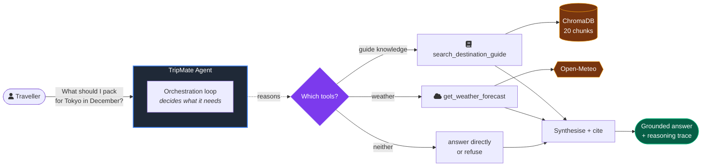
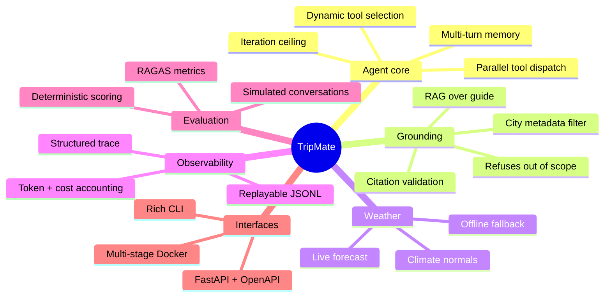
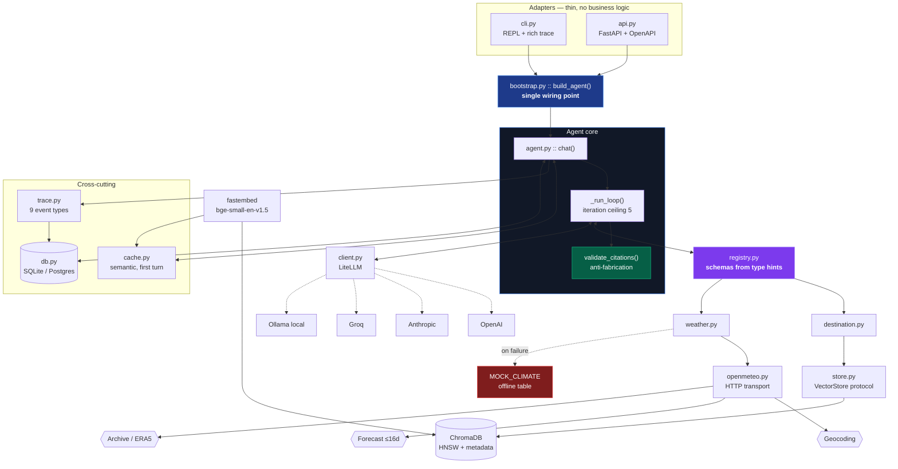
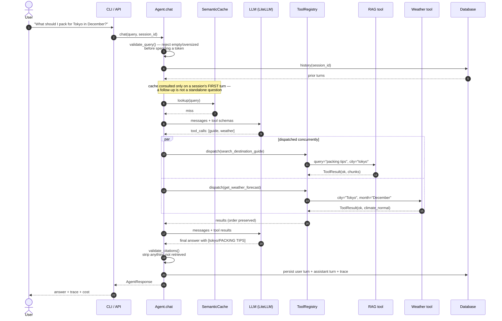
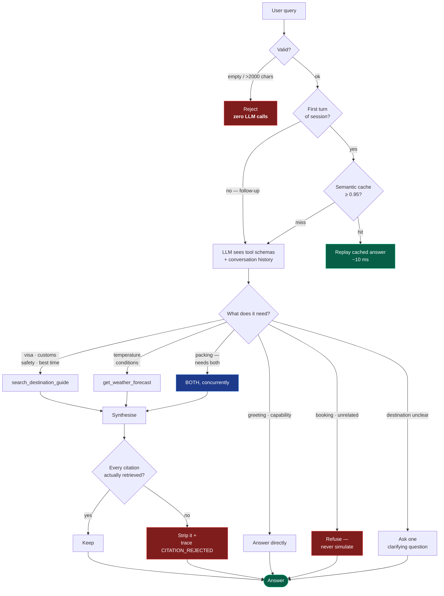
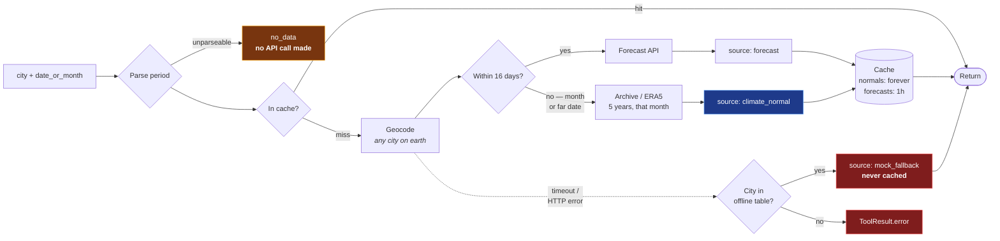
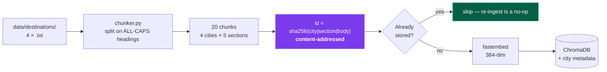
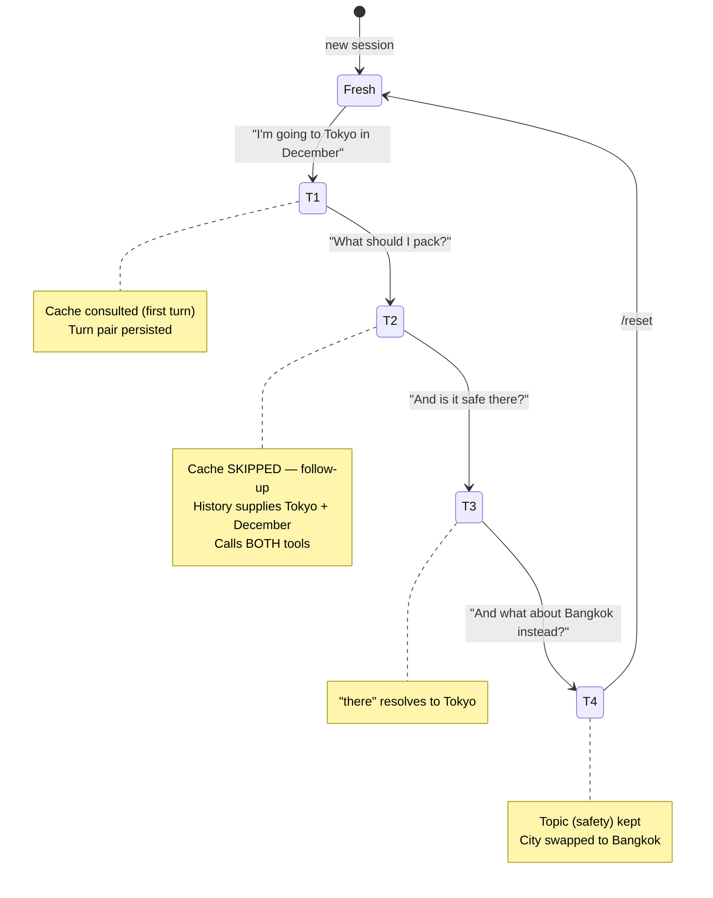
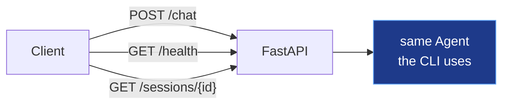
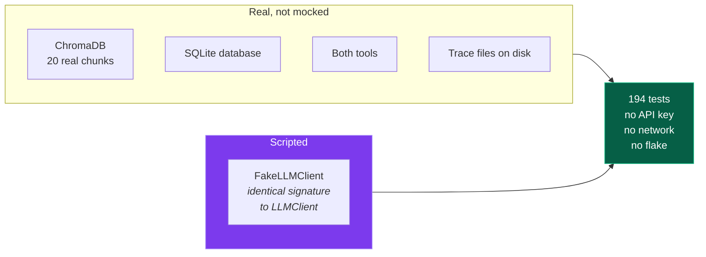

# TripMate — Agentic AI Travel Assistant

An LLM agent that answers travel questions about four destinations by **deciding for
itself** which tools it needs per query. No keyword routing, no fixed script: the model
is given tool schemas and picks. Every decision it makes is visible in a structured trace.

Built for the AI Agent Developer technical assessment.



| | |
|---|---|
| **Tests** | 194 passing, 96% coverage |
| **Model** | any provider via LiteLLM — verified on 3 |
| **Tool selection accuracy** | 86.7% across 30 eval cases |
| **Destinations** | Tokyo · Reykjavik · Bangkok · Barcelona |
| **Interfaces** | CLI · REST API · Docker |

---

## Contents

1. [What it does](#1-what-it-does)
2. [Quickstart](#2-quickstart)
3. [Architecture](#3-architecture)
4. [Tool schemas as given to the LLM](#4-tool-schemas-as-given-to-the-llm)
5. [Example runs](#5-example-runs)
6. [Interfaces](#6-interfaces)
7. [Design decisions](#7-design-decisions)
8. [Evaluation](#8-evaluation)
9. [Testing](#9-testing)
10. [Scalability](#10-scalability)
11. [Known limitations](#11-known-limitations)
12. [Future improvements](#12-future-improvements)
13. [Deliberately out of scope](#13-deliberately-out-of-scope)

---

## 1. What it does

### Feature map



### Capability table

| Capability | How it works | Where |
|---|---|---|
| **Dynamic tool selection** | Tool schemas derived from type hints, handed to the LLM; it chooses | `tools/registry.py` |
| **RAG retrieval** | ChromaDB, cosine, city metadata pre-filter, score floor | `rag/store.py` |
| **Weather** | Open-Meteo: forecast ≤16 days, else climate normal from 5y ERA5 | `tools/weather.py` |
| **Multi-tool reasoning** | Both tools in one turn, dispatched concurrently, reconciled | `core/agent.py` |
| **Multi-turn memory** | Turns persisted; follow-ups resolve "there" / "instead" | `db.py` |
| **Citation validation** | Every `[city/SECTION]` checked against chunks actually retrieved | `core/agent.py` |
| **Semantic cache** | Paraphrase within 0.95 cosine replays the answer, first turn only | `core/cache.py` |
| **Graceful degradation** | Weather API down → offline table, `FALLBACK_USED` traced | `tools/weather.py` |
| **Scope awareness** | Booking / unrelated topics refused, never simulated | `core/prompts.py` |
| **Reasoning trace** | 9 event types, append-only JSONL, replayable offline | `core/trace.py` |
| **Cost accounting** | Per-turn tokens, cost, latency | `core/trace.py` |
| **Provider agnostic** | `LLM_MODEL` env var; OpenAI, Anthropic, Groq, Ollama, … | `llm/client.py` |
| **Eval harness** | 3 layers: deterministic, RAGAS, simulated conversations | `evals/` |

---

## 2. Quickstart

```bash
git clone <repo> && cd tripmate
uv venv && uv pip install -e ".[dev]"

cp .env.example .env          # set LLM_MODEL and LLM_API_KEY
uv run tripmate-ingest        # loads 20 chunks into ChromaDB (idempotent)

uv run tripmate               # interactive CLI
```

**No API key?** Set `LLM_MODEL=ollama/qwen3.5` and the whole system runs locally with
no key at all. Needs roughly 8 GiB free RAM for that model.

### Other entry points

```bash
uv run uvicorn tripmate.adapters.api:app --reload   # REST API + docs at :8000/docs
uv run python -m evals.run_evals                    # evaluation scorecard
uv run pytest -q                                    # 194 tests
docker build -t tripmate . && docker run -p 8000:8000 --env-file .env tripmate
```

### CLI commands

| Command | Does |
|---|---|
| `/trace` | Full reasoning trace for the last turn |
| `/cost` | Session token and dollar total |
| `/reset` | New session (clears conversation memory) |
| `/quit` | Exit |

---

## 3. Architecture

### 3.1 System



### 3.2 Request lifecycle

One turn, end to end:



### 3.3 How the agent decides



### 3.4 Weather routing — why it isn't just a forecast call

A forecast API reaches about 16 days. *"What should I pack for Tokyo in December?"* is
not a forecast question — it is a **climate normal**. Getting this wrong is the most
common way this feature is built badly.



The `source` field travels with every response, so the agent can say *"typical December
conditions"* rather than presenting a five-year average as a forecast.

### 3.5 Ingestion pipeline



Content-addressed ids are what make `tripmate-ingest` safe to run on every startup —
verified: first run ingests 20, second ingests 0.

### 3.6 Multi-turn memory



> **A bug this design caught.** The cache originally keyed on query text alone, so
> *"What should I pack?"* in turn 2 replayed a context-free answer cached from an
> unrelated session. A follow-up is not a standalone question — the cache is now
> consulted and populated only on a session's first turn. Standalone repeats still hit.

---
## 4. Tool schemas as given to the LLM

Real output of:

```bash
uv run python -c "
import json
from tripmate.tools.registry import ToolRegistry
from tripmate.tools.destination import search_destination_guide
from tripmate.tools.weather import get_weather_forecast
r = ToolRegistry(); r.register(search_destination_guide); r.register(get_weather_forecast)
print(json.dumps(r.schemas(), indent=2))"
```

```json
[
  {
    "type": "function",
    "function": {
      "name": "search_destination_guide",
      "description": "Search the destination knowledge base for visa, weather-season, customs, packing and safety guidance.",
      "parameters": {
        "properties": {
          "query": {
            "description": "The travel question or topic, e.g. 'visa requirements' or 'what to pack'.",
            "type": "string"
          },
          "city": {
            "anyOf": [
              { "type": "string" },
              { "type": "null" }
            ],
            "default": null,
            "description": "Destination city to restrict the search to. One of: tokyo, reykjavik, bangkok, barcelona. Omit when the question is not about a specific city."
          }
        },
        "required": ["query"],
        "type": "object"
      }
    }
  },
  {
    "type": "function",
    "function": {
      "name": "get_weather_forecast",
      "description": "Get the expected weather for a city on a specific date or during a given month.",
      "parameters": {
        "properties": {
          "city": {
            "description": "City name, e.g. 'Tokyo'.",
            "type": "string"
          },
          "date_or_month": {
            "description": "An ISO date like '2026-12-25' for near-term forecasts, or a month name like 'December' for typical seasonal conditions.",
            "type": "string"
          }
        },
        "required": ["city", "date_or_month"],
        "type": "object"
      }
    }
  }
]
```

There is no hand-written schema anywhere in the codebase — `tools/registry.py` derives
both the schema and the pydantic argument-validation model from each function's type
hints and `Annotated` descriptions, so the signature and the schema the LLM sees cannot
drift apart.

## 5. Example runs

Five real interactions captured on `groq/openai/gpt-oss-120b`. Full event-by-event
traces are committed as JSONL in [`traces/`](traces/).

| Trace file | Query | Tools | Events |
|---|---|---|---|
| [`example_single_tool_rag.jsonl`](traces/example_single_tool_rag.jsonl) | Do I need a visa to visit Japan? | `search_destination_guide` | 6 |
| [`example_single_tool_weather.jsonl`](traces/example_single_tool_weather.jsonl) | How cold does Reykjavik get in January? | `get_weather_forecast` | 7 |
| [`example_multi_tool_packing.jsonl`](traces/example_multi_tool_packing.jsonl) | What should I pack for Tokyo in December? | **both** | 9 |
| [`example_out_of_scope.jsonl`](traces/example_out_of_scope.jsonl) | Can you book my flight to Barcelona? | none | 3 |
| [`example_weather_fallback.jsonl`](traces/example_weather_fallback.jsonl) | Packing query, weather API unreachable | both, degraded | 9 |

### 5.1 Multi-tool — the case Module 4 grades

**Input:** `What should I pack for Tokyo in December?`

```
QUERY_RECEIVED      query="What should I pack for Tokyo in December?"
                    prompt_version=d3322c056668
LLM_CALL      1.1s  requested_tools=[search_destination_guide, get_weather_forecast]
TOOL_CALL           search_destination_guide {"query":"packing tips","city":"tokyo"}
TOOL_CALL           get_weather_forecast     {"city":"Tokyo","date_or_month":"December"}
TOOL_RESULT     8ms status=ok  texts=["Tokyo — PACKING TIPS\nLayered clothing works..."]
TOOL_RESULT    2.2s status=ok  source=climate_normal temp_range_c=[2.5, 11.8]
LLM_CALL      1.4s  (tools omitted — synthesis)
ANSWER_SYNTHESIZED  citations=[tokyo/PACKING TIPS, tokyo/SAFETY & HEALTH]
```

**Output** (abridged):

> **Packing list for Tokyo in December**
> - **Warm, layered clothing** — base layer, sweaters, insulated coat. *Tokyo's guide recommends layered clothing for seasonal variation* `[tokyo/PACKING TIPS]`
> - **Comfortable walking shoes** — you'll be on foot a lot `[tokyo/PACKING TIPS]`
> - **Compact umbrella** — December is generally dry, about 6 rainy days
> - **Reusable water bottle** — tap water is safe to drink `[tokyo/SAFETY & HEALTH]`
>
> Typical December: 2.5–11.8 °C, mild and mostly dry.

The agent worked out unprompted that packing advice needs *both* the guide's tips and
the actual conditions, then reconciled them.

### 5.2 Single tool — RAG

**Input:** `Do I need a visa to visit Japan as a tourist?`

```
QUERY_RECEIVED  →  LLM_CALL (requested: search_destination_guide)
TOOL_CALL          search_destination_guide {"query":"visa entry requirements","city":"tokyo"}
TOOL_RESULT        status=ok
LLM_CALL           ANSWER_SYNTHESIZED citations=[tokyo/VISA & ENTRY]
```

One tool. Nothing instructed it — the choice came from the schema descriptions.

### 5.3 Out of scope — Module 5

**Input:** `Can you book my flight to Barcelona?`

```
QUERY_RECEIVED  →  LLM_CALL  →  ANSWER_SYNTHESIZED
(no TOOL_CALL events at all)
```

> I'm sorry — I can't book, change, or pay for flights or any other reservations. I can,
> however, help with visa requirements, the best time to visit, local customs, packing
> tips, safety notes, or typical weather for Barcelona.

Three events, no tool calls, **no invented confirmation number**. The eval suite asserts
the answer never contains "booked", "confirmed" or "reservation number".

### 5.4 Failure path — graceful degradation

**Input:** same packing query, with the weather API unreachable.

```
TOOL_RESULT    get_weather_forecast  status=ok
FALLBACK_USED  get_weather_forecast
```

The agent still answers, using the offline climate table, and the response carries
`source: mock_fallback` so it can tell the user the figures are approximate. The
degradation is visible in the trace — never silent.

### 5.5 Multi-turn

```
> I'm planning a trip to Tokyo in December.     tools=[guide, weather]
> What should I pack?                            tools=[weather, guide]  ← inherited Tokyo
> And is it safe there?                          tools=[guide]           ← "there" = Tokyo
> And what about Bangkok instead?                tools=[guide]           ← topic kept, city swapped
```

Turn 4 is the interesting one: it retained the *topic* (safety) from turn 3 while
switching the *city*.

---

## 6. Interfaces

### REST API

Three endpoints, all with typed OpenAPI schemas at `/docs`.



| Endpoint | Returns |
|---|---|
| `POST /chat` | `{answer, citations[], trace[], prompt_tokens, completion_tokens, cost_usd, latency_ms, session_id, was_cached}` |
| `GET /health` | `{status, model, tools[], chunk_count}` |
| `GET /sessions/{id}` | `{session_id, turns[]}` |

```bash
curl -X POST localhost:8000/chat -H 'content-type: application/json' \
  -d '{"query":"What should I pack for Tokyo in December?","session_id":"demo"}'
```

Verified live: `/health` reports `chunk_count: 20`; passing the same `session_id` twice
gives multi-turn over HTTP, and `/sessions/demo` returns the full conversation.

### Configuration

Everything is environment-driven and validated at startup — a missing key fails
immediately with a clear message, not mid-conversation.

| Variable | Default | Purpose |
|---|---|---|
| `LLM_MODEL` | `gpt-4o-mini` | Any LiteLLM model string |
| `LLM_API_KEY` | — | Mapped to the provider's own variable automatically |
| `LLM_BASE_URL` | — | Override endpoint (Ollama, vLLM, gateway) |
| `LLM_TEMPERATURE` | `0.2` | Low: tool calling wants determinism |
| `RAG_TOP_K` | `4` | Chunks retrieved per search |
| `RAG_MIN_SCORE` | `0.25` | Similarity floor; below it, return nothing |
| `MAX_TOOL_ITERATIONS` | `5` | Loop ceiling |
| `SEMANTIC_CACHE_THRESHOLD` | `0.95` | Cosine similarity for a replay |
| `WEATHER_TIMEOUT_S` | `3` | Before falling back offline |
| `DATABASE_URL` | `sqlite:///./tripmate.db` | `postgresql+psycopg://…` also works |

**Provider swap is config-only.** Verified across three models — same code, `LLM_MODEL`
changed, all three correctly chose both tools:

| Model | Tools chosen | Latency |
|---|---|---|
| `groq/openai/gpt-oss-120b` | both | 4447 ms |
| `groq/openai/gpt-oss-20b` | both | 1527 ms |
| `groq/qwen/qwen3.8-27b` | both | 1679 ms |

---
## 7. Design decisions

| # | Decision | Choice | Rationale | Rejected |
|---|---|---|---|---|
| D1 | LLM provider | **LiteLLM**, provider set by env | User picks any model: OpenAI, Anthropic, Gemini, Groq, Ollama. One dependency normalizes tool-call schemas across all of them. | Hand-rolled per-provider adapters — LiteLLM already does this |
| D2 | Orchestration | **Raw function-calling loop** (~90 lines) | Every line is explainable on video; the reasoning trace is ours to emit; no framework lock-in; the flow is one loop with one branch | LangChain (heavy, trace buried in callbacks); LangGraph (state-graph machinery for a non-branchy flow) |
| D3 | Vector store | **ChromaDB (persistent)** behind a `VectorStore` Protocol | Metadata pre-filtering by city is *required* at scale and cannot be bolted on later without reshaping the tool signature. HNSW index — identical code path at 20 or 200k chunks | numpy cosine (no metadata filter); FAISS (no metadata/persistence ergonomics); pgvector (infra for a take-home) |
| D4 | Embeddings | **`fastembed`** (`BAAI/bge-small-en-v1.5`, ONNX) | ~50MB, no PyTorch. Local and keyless — preserves D1's promise that Ollama alone is sufficient | `sentence-transformers` (drags in ~800MB torch); OpenAI embeddings (couples RAG to one provider, breaks D1) |
| D5 | Weather | **Open-Meteo dual-path** + disk cache + mock fallback | Forecast APIs reach 16 days; the grading query ("packing for Tokyo in December") needs a **climate normal**. Geocoding resolves any city on earth | Forecast-only (fails Module 4); pure mock table (dies past 4 cities) |
| D6 | Differentiators | Tier 1 + Tier 2 (eval harness, citations, semantic cache, parallel dispatch, cost accounting, multi-turn) | Depth on graded axes over breadth of features | Tier 3 padding — see §12 below |
| D7 | API layer | **FastAPI**, thin adapter over the same `Agent` | Largest single JD bullet. ~50 lines. Mirrors the same adapter-over-one-core pattern as the CLI | Flask (JD accepts either; FastAPI is async-native and self-documenting) |
| D8 | Container | **Multi-stage Dockerfile** | Makes the "multi-stage build" claim demonstrable | docker-compose stack, k8s manifests — padding here |
| D9 | Persistence | **SQLAlchemy over SQLite, Postgres-ready** | Sessions and traces persisted; `DATABASE_URL` swaps to Postgres with no code change. Zero reviewer setup | Required Postgres (reviewer friction); in-memory (leaves a JD bullet untouched) |

### On not using LangGraph

> This flow is a single loop with one branch. LangGraph's state-graph machinery would add a
> dependency and a layer of indirection without removing code we would otherwise write.
> Where it *would* earn its place: human-in-the-loop interrupts, checkpointed long-running
> workflows, branching multi-agent handoff. The tool registry is framework-agnostic, so the
> tools port to LangGraph unchanged if the flow later becomes branchy.

## 8. Evaluation

Agents fail probabilistically, so functional tests alone are not sufficient evidence
the system works. The eval harness (`evals/`) has three layers of increasing cost and
decreasing determinism:

**Layer 1 — Deterministic (`evals/deterministic.py`).** No LLM judging, exact
assertions over `evals/dataset.yaml` (30 hand-authored queries): tool-selection
accuracy (did the agent call exactly the expected tool set), citation validity (does
every citation map to a chunk actually retrieved this turn), refusal correctness (did
out-of-scope queries get refused and in-scope ones not), and p50/p95 latency plus total
cost. This layer needs no API key beyond whatever provider is configured for the run —
no separate judge model.

**Layer 2 — RAGAS (`evals/ragas_eval.py`).** Industry-standard RAG metrics —
`faithfulness`, `answer_relevancy`, `context_precision` — computed over the guide text
the agent actually retrieved that turn (pulled from the trace's `TOOL_RESULT` events,
not re-run), so scoring never diverges from what really informed the answer. Opt-in,
requires an LLM key, marked slow.

**Layer 3 — Simulated user (`evals/simulation.py`).** An LLM plays a traveler across
scripted multi-turn conversations (e.g. "Going to Tokyo in December" → "What should I
pack?" → "And what about Bangkok instead?"), scored on goal completion and whether
context carried across turns. Single-turn evals cannot catch a follow-up losing the
thread; this layer can.

Reproduce:

```bash
uv run python -m evals.run_evals --ragas --simulation
```

Results:

Measured on `groq/openai/gpt-oss-120b`, 30 deterministic cases and 3 simulated
conversations. The semantic cache is disabled for eval runs — replaying a cached answer
skips tool calls entirely, which makes tool selection unmeasurable.

Two independent runs are reported rather than one, because these metrics are
stochastic — the same query can cite on one run and not the next. A single snapshot
presented as definitive would overstate what the harness actually measures.

| Layer | Metric | Run 1 | Run 2 |
|---|---|---|---|
| Deterministic | Tool-selection accuracy | 86.7% | 86.7% |
| Deterministic | Citation validity | 100% | 96.7% |
| Deterministic | Refusal accuracy | 93.3% | 93.3% |
| Deterministic | Overall pass rate | 80.0% | 76.7% |
| Deterministic | p50 / p95 latency | 1146 / 4378 ms | 2008 / 4987 ms |
| Simulation | Goal completion | 100% (3/3) | — |
| Simulation | Context retention | kept (3/3) | — |
| RAGAS | faithfulness / relevancy / precision | not run — see below | |

The single-point difference in citation validity is one case that cited on one run and
not the other; re-running that case in isolation passes. Tool selection and refusal
accuracy are stable across runs, which is the signal worth trusting here.

**What the remaining failures are.** Four of the 30 cases fail tool selection, and all
four are the same disagreement: for a destination outside the four covered cities
(`Paris`, `Atlantis`, `Seoul`) or a topic outside the guide's five sections (Tokyo metro
ticket prices), the dataset expects the agent to call the tool and receive a `no_data`
result, while the model instead declines to call it at all — the system prompt already
names its coverage, so it answers the limitation directly. Both behaviours avoid
fabrication, and the model's is cheaper by one tool call. The dataset expectation is
arguably too prescriptive here; it is left unchanged rather than tuned to match observed
behaviour, because rewriting an assertion to fit the model is how an eval stops
measuring anything.

**Two defects this harness found in itself.** Worth recording, because both would have
silently understated the agent:

1. Refusal detection matched the ASCII apostrophe in `can't`, but the model emits the
   typographic `can’t` (U+2019). Every correct refusal scored as a failure. Fixed by
   folding smart punctuation to ASCII before matching — refusal accuracy went 83.3% to
   93.3%, with no change to the agent.
2. Eval runs shared the semantic cache with manual runs, so repeated queries replayed a
   cached answer in ~10 ms with zero tool calls and scored as routing failures. Fixed by
   disabling the cache for eval runs — overall pass rate went 66.7% to 80.0%.

**RAGAS is not in these numbers.** The installed `ragas` fails at import against the
resolved `langchain-community`:

```
ModuleNotFoundError: No module named 'langchain_community.chat_models.vertexai'
```

This is an upstream version incompatibility, not a defect in `evals/ragas_eval.py`,
which is complete and wired into `run_evals.py`. Pinning `ragas<0.3` reproduces the same
error; pinning `langchain-community<0.3` trades it for a different one
(`cannot import name 'ContextOverflowError'`). Resolving it needs a compatible triple of
`ragas`, `langchain-core` and `langchain-community`, which is left as a known limitation
rather than pinned by guesswork.

## 9. Testing



Everything is real except the model. `FakeLLMClient` replays scripted responses and
records every request; it satisfies the same `SupportsComplete` protocol as the real
client, which is what lets the whole suite run in CI for free.

| File | Covers |
|---|---|
| `test_config.py` | Settings validation, provider→env-var mapping |
| `test_models.py` | Domain types, citation parsing |
| `test_registry.py` | Schema derivation, arg validation, exception containment |
| `test_chunker.py` | Section splitting, content-hashed ids |
| `test_store.py` | Retrieval, city filter, score floor, idempotent ingest |
| `test_tools_destination.py` | RAG tool, `no_data` path, thread-safe init |
| `test_tools_weather.py` | Both routing paths, cache, timeout → fallback |
| `test_llm_client.py` | Response parsing, malformed tool args |
| `test_trace.py` | Event recording, totals, append-only JSONL, replay |
| `test_db.py` | Sessions, turns, history ordering, rollback |
| `test_cache.py` | Cosine, threshold, disabled cache, citation round-trip |
| `test_agent.py` | The loop, citations, ceiling, multi-turn regressions |
| `test_tool_selection.py` | Single / multi / no-tool routing |
| `test_error_scenarios.py` | All six scenarios named in the brief |
| `test_integration_multitool.py` | Full flow: real RAG + DB + cache |
| `test_api.py` | All three endpoints |
| `test_evals_*.py` | Scoring logic |

```bash
uv run pytest -q                              # 194 passed
uv run pytest --cov --cov-report=term-missing # 96% (gate at 80)
```

**Error scenarios** — one named test per bullet in the brief:

| Scenario | Tests |
|---|---|
| Unknown / unsupported destination | 2 |
| Missing or incomplete weather data | 2 |
| Ambiguous user query | 1 |
| Tool failure or timeout | 3 |
| Out-of-scope request | 2 |
| Malformed or empty input | 3 |

One test worth explaining: in `test_integration_multitool.py` the script holds exactly
two LLM responses, both consumed by the first query. The second identical query must be
served from cache — if it weren't, the exhausted fake would raise `script exhausted`.
**The test passing is the proof the cache prevented the LLM calls.**

---
## 10. Scalability

**RAG from 4 cities to several hundred.** 4 cities and 4,000 cities run *identical
code paths*. 400 cities is ~2,000 chunks; 4,000 is ~20,000 — well within Chroma's HNSW
index. What changes: (a) config, swapping the persistent client for a Chroma server or
pgvector behind the same `VectorStore` Protocol; (b) ingest becomes a batch job,
already idempotent via content hashing. The real bottleneck at that size is
**retrieval precision, not speed** — semantic search over 20k chunks returns Seoul's
visa section for a Tokyo query. The city-metadata pre-filter already in the tool
signature is the mitigation; reranking is the next step after that.

**Avoiding redundant tool and LLM calls.** Implemented, not hypothetical: a semantic
query cache (cosine ≥ 0.95 replays a stored answer) plus permanent disk caching of
climate normals, which never change. Next step at volume: a shared Redis cache so the
hit rate is cross-process rather than per-instance.

**Reducing LLM cost at higher volume.** Tiered routing — a small model handles tool
selection while a stronger one handles synthesis only when needed. Prompt caching for
the static system prompt. Trimming tool schemas sent per request. Batching evals
offline rather than live. Per-query cost is already measured, so any optimization is
verifiable rather than assumed.

**Keeping tool-selection latency low as tools grow.** At ~10 tools, send all schemas.
Past that, embed tool descriptions and send only the top-K most relevant to the query —
`ToolRegistry.schemas()` is the single seam where this plugs in. Beyond ~50 tools,
hierarchical routing: pick a tool *category* first, then a tool within it.

## 11. Known limitations

- The destination pack is a simplified reference dataset, not authoritative travel or
  visa advice. The agent states this.
- Climate normals are five-year ERA5 averages — an indication of typical conditions,
  not a forecast. The response labels its own provenance.
- Retrieved guide text is treated as trusted. A production system ingesting
  third-party content would need prompt-injection defenses on retrieved chunks.
- The semantic cache is per-process. Multi-instance deployment needs shared cache
  storage.
- Multi-turn history is unbounded within a session; a long conversation would
  eventually need summarization or windowing.
- Evaluation dataset is ~30 queries, hand-authored — enough to catch regressions, not
  enough for statistical confidence.

## 12. Future improvements

1. Reranking stage (retrieve top-20, rerank to top-4) once the corpus exceeds a few
   thousand chunks
2. Hybrid search (BM25 + dense) for exact terms like visa category codes
3. Query rewriting for multi-hop questions ("compare Tokyo and Bangkok in July")
4. Redis-backed shared semantic cache for horizontal scaling
5. Tiered model routing — cheap selection, strong synthesis
6. Streaming token output for perceived latency
7. OpenTelemetry export — the trace event model already fits the span shape
8. Conversation summarization for long sessions

## 13. Deliberately out of scope

| Excluded | Why |
|---|---|
| Web UI | Grading explicitly excludes UI polish |
| docker-compose / k8s manifests | One Dockerfile proves the competence; the rest is padding |
| User auth / multi-tenancy | No user model in the problem statement |
| LangSmith / external tracing SaaS | Local structured tracing is sufficient and dependency-free |
| Multi-agent crew | One agent with two tools; more agents would be architecture theater |
| Token streaming | Adds transport complexity; the trace is what needs to be visible here |
| Reranking | Meaningful past a few thousand chunks; noted as a scale path instead |
