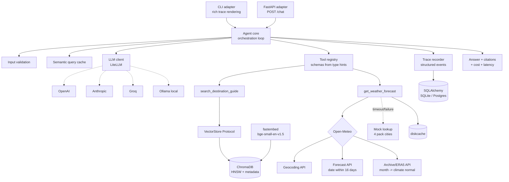

# Architecture

## Diagram



## Request flow

```
query
  |
  1. validate at boundary ......... empty / >2000 chars / non-text -> reject, zero LLM spend
  2. semantic cache probe ......... cosine >= 0.95 vs past queries -> replay, emit CACHE_HIT
  3. LLM call  <---------------+ ... messages = system + history + user
  |    tool schemas from registry (auto-derived from type hints)
  4. tool_calls returned?      |
  |    a. validate args (per-tool pydantic model)
  |    b. dispatch in PARALLEL (ThreadPoolExecutor) - independent tools overlap
  |    c. each: timeout -> retry x1 -> fallback; never raises into the loop
  |    d. append tool results --+ ... max MAX_TOOL_ITERATIONS, then force-synthesize
  5. final answer
       + citations [tokyo/PACKING TIPS]
       + citation validation (strip any not present in retrieved chunk ids)
       + trace footer: tools used | latency | tokens | cost USD
```

The loop is provider-agnostic. The identical code path runs against GPT-4o-mini, Claude,
Llama-3.3 on Groq, or local Qwen — LiteLLM normalizes the tool-call response shape.

## Components

**CLI adapter — `src/tripmate/adapters/cli.py`**
Multi-turn REPL built on `rich`. Renders the reasoning trace as a table after every
turn, plus a per-turn footer of tokens, cost, and latency. Commands: `/trace`, `/cost`,
`/reset`, `/quit`.

**FastAPI adapter — `src/tripmate/adapters/api.py`**
Thin HTTP shell over the same `Agent`. Routes: `POST /chat`, `GET /health`,
`GET /sessions/{id}`. The agent is built lazily on first request (`_ensure_agent`) so
importing the module — and therefore `uvicorn tripmate.adapters.api:app` — never touches
a provider or the database at import time.

**Bootstrap — `src/tripmate/bootstrap.py`**
The single wiring point both adapters call (`build_agent`). It runs the idempotent
ingest, injects the vector store into the destination tool, registers both tools, opens
the database, and constructs the `Agent`. Not in the original spec's module table —
added so the CLI and API adapters cannot wire the agent two different ways and drift
apart.

**Agent core — `src/tripmate/core/agent.py`**
The orchestration loop (`Agent.chat`). Validates input, probes the semantic cache, calls
the LLM, dispatches any requested tools concurrently via `ThreadPoolExecutor`, feeds
results back as tool messages, and repeats until the model stops requesting tools or
`MAX_TOOL_ITERATIONS` is hit (at which point it force-synthesizes from whatever tool
output exists). Citation validation and trace emission happen here too.

**System prompt — `src/tripmate/core/prompts.py`**
The versioned system prompt (`SYSTEM_PROMPT`, `PROMPT_VERSION`) that encodes tool
policy, the citation format, refusal rules, and the grounding rule. Kept out of the
loop as a plain string, not an f-string, so it can be diffed and eval'd independently
of code changes.

**Trace recorder — `src/tripmate/core/trace.py`**
`Tracer` records structured `TraceEvent`s (`QUERY_RECEIVED`, `CACHE_HIT`, `LLM_CALL`,
`TOOL_CALL`, `TOOL_RESULT`, `TOOL_ERROR`, `FALLBACK_USED`, `CITATION_REJECTED`,
`ANSWER_SYNTHESIZED`) and appends them as JSONL, one file per session, under
`traces/`. `load_trace` reads a file back for offline replay.

**Semantic cache — `src/tripmate/core/cache.py`**
`SemanticCache` embeds each incoming query with the same `fastembed` model used for
retrieval, compares it against previously stored query embeddings by cosine
similarity, and replays the stored answer above `SEMANTIC_CACHE_THRESHOLD`. Persisted
in the `query_cache` table via `Database`.

**LLM client — `src/tripmate/llm/client.py`**
`LLMClient` wraps `litellm.completion`, parses the response into the internal
`LLMResponse`/`ToolCall` shape regardless of provider, and extracts token counts and
cost via `litellm.completion_cost`. `build_llm_client` reads `Settings` and calls
`settings.export_provider_key()` first so LiteLLM finds the right provider-specific
environment variable.

**Tool registry — `src/tripmate/tools/registry.py`**
The `@tool` decorator inspects a function's type hints and `Annotated` metadata and
derives both a pydantic argument model and the OpenAI-format JSON schema — there is no
hand-written schema anywhere. `ToolRegistry.dispatch` validates arguments against that
model and always returns a structured `ToolResult`; it never lets an exception escape
into the agent loop.

**Destination tool — `src/tripmate/tools/destination.py`**
`search_destination_guide` — the RAG tool. Delegates to a `VectorStore` (injected via
`set_store`, normally a `ChromaStore`), passing the LLM-extracted `city` through as a
Chroma metadata pre-filter. Returns `ToolResult.no_data(...)` with the list of
supported cities when nothing scores above the floor, rather than returning
nearest-neighbor noise.

**Weather tool — `src/tripmate/tools/weather.py`**
`get_weather_forecast` owns routing, caching and the mock fallback. `resolve_period`
decides whether the requested date is inside the 16-day forecast horizon or needs a
climate normal; `describe` turns numbers into a short phrase; `MOCK_CLIMATE` is the
offline fallback table for the four pack cities, used only when the live call raises.
Results are cached via `diskcache`: climate normals permanently, forecasts on a TTL.

**Open-Meteo transport — `src/tripmate/tools/openmeteo.py`**
Pure HTTP layer with no tool logic or caching: `geocode`, `fetch_forecast`,
`fetch_archive`, and `summarise` (averages daily temperature/precipitation records,
skipping null-temperature days from ERA5's ~5-day publication lag). This module did
not exist as a separate file in the original design spec — the transport was split out
of `weather.py` during implementation to keep each file under the line-count target and
to let the HTTP boundary be mocked independently in tests (`respx`).

**Vector store — `src/tripmate/rag/store.py`**
`VectorStore` is a `Protocol`; `ChromaStore` is its only implementation, backed by a
persistent Chroma collection with cosine HNSW indexing and local ONNX embeddings
(`fastembed`). `add` is idempotent by content hash; `search` converts Chroma's cosine
distance to similarity before applying `min_score` and an optional city filter.

**Chunker — `src/tripmate/rag/chunker.py`**
`parse_guide` splits one destination `.txt` file into one `Chunk` per ALL-CAPS section
heading; `chunk_id` derives a stable id from `sha256(city|section|body)`, which is what
makes `ingest` idempotent. `load_all` parses every guide in a directory.

**Ingest — `src/tripmate/rag/ingest.py`**
`ingest()` loads all guides and adds any chunk not already present, by hash, to the
store. `main()` is the `tripmate-ingest` console script entry point.

**Persistence — `src/tripmate/db.py`**
`Database` wraps a SQLAlchemy engine and session factory (pool settings applied only
for non-SQLite URLs). Four tables: `sessions`, `turns`, `trace_records`, `query_cache`.
`SessionStore` is the read/write API the agent and cache use — `add_turn`,
`add_trace`, `history`.

**Configuration — `src/tripmate/config.py`**
`Settings` (pydantic-settings) is the single source of truth for every tunable,
loaded from environment variables or `.env`. `export_provider_key` maps the one
`LLM_API_KEY` the user sets to whichever provider-specific variable LiteLLM expects,
skipping the check entirely for keyless providers (Ollama). Raises `ConfigError` at
startup, not mid-query, when a required key is missing.

**Models — `src/tripmate/models.py`**
Shared pydantic models: `Chunk`, `WeatherReport`, `ToolResult`, `ToolCall`,
`LLMResponse`, `TraceEvent`, `Citation`, `AgentResponse`. `Citation.ref` and
`Chunk.ref` both produce the `"{city}/{section}"` string used in citations and trace
payloads, so the two never drift independently.
