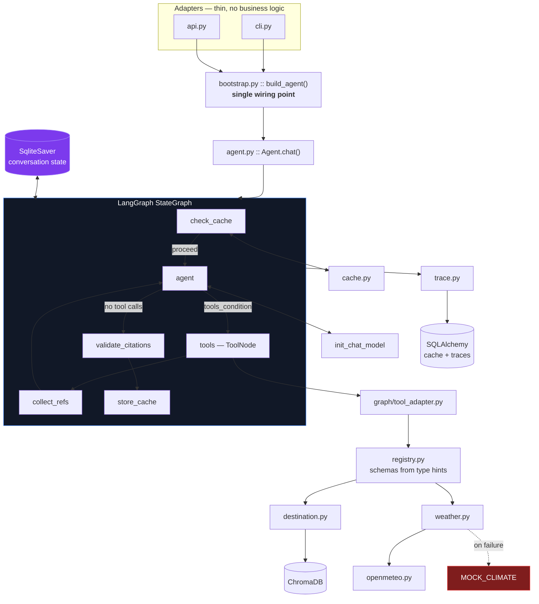

# Architecture

## Diagram



## Request flow

```
query
  1. Agent.chat validates input .............. empty / >2000 chars -> reject, 0 LLM calls
  2. graph.invoke(thread_id=session_id) ...... checkpointer reloads prior messages
  3. check_cache ............................. first turn only; a hit routes to END
  4. agent ................................... LLM with tool schemas bound
  5. tools_condition ......................... tool calls present -> tools, else -> validate
  6. ToolNode ................................ executes; adapter serialises ToolResult
  7. collect_refs ............................ trace events + citation whitelist
  8. (loop back to agent)
  9. validate_citations ...................... strips any ungrounded [city/SECTION]
 10. store_cache ............................. first turn only
     -> answer + citations + trace + cost
```

The recursion limit derives from `max_tool_iterations`; exceeding it raises
`GraphRecursionError`, which the facade converts into the empty-answer fallback rather
than surfacing a framework exception.

## Components

**CLI adapter — `src/tripmate/adapters/cli.py`**
Multi-turn REPL built on `rich`. Renders the reasoning trace as a table after every
turn, plus a per-turn footer of tokens, cost, and latency. Commands: `/trace`, `/cost`,
`/reset`, `/quit`.

**FastAPI adapter — `src/tripmate/adapters/api.py`**
Thin HTTP shell over the same `Agent`. Routes: `POST /chat`, `GET /health`,
`GET /sessions/{id}`. The agent is built lazily on first request (`_ensure_agent`) so
importing the module — and therefore `uvicorn tripmate.adapters.api:app` — never touches
a provider or the database at import time.

**Bootstrap — `src/tripmate/bootstrap.py`**
The single wiring point both adapters call (`build_agent`). It runs the idempotent
ingest, injects the vector store into the destination tool, registers both tools, opens
the database, and constructs the `Agent`. Not in the original spec's module table —
added so the CLI and API adapters cannot wire the agent two different ways and drift
apart.

**Agent facade — `src/tripmate/core/agent.py`**

Public surface (`chat`, `registry`, `settings`, `graph`) plus the pure helpers
`validate_query`, `extract_citations` and `validate_citations`. Input validation stays
outside the graph so malformed input costs zero LLM calls. Orchestration itself lives in
`graph/`.

**System prompt — `src/tripmate/core/prompts.py`**
The versioned system prompt (`SYSTEM_PROMPT`, `PROMPT_VERSION`) that encodes tool
policy, the citation format, refusal rules, and the grounding rule. Kept out of the
loop as a plain string, not an f-string, so it can be diffed and eval'd independently
of code changes.

**Trace recorder — `src/tripmate/core/trace.py`**
`Tracer` records structured `TraceEvent`s (`QUERY_RECEIVED`, `CACHE_HIT`, `LLM_CALL`,
`TOOL_CALL`, `TOOL_RESULT`, `TOOL_ERROR`, `FALLBACK_USED`, `CITATION_REJECTED`,
`ANSWER_SYNTHESIZED`) and appends them as JSONL, one file per session, under
`traces/`. `load_trace` reads a file back for offline replay.

**Semantic cache — `src/tripmate/core/cache.py`**
`SemanticCache` embeds each incoming query with the same `fastembed` model used for
retrieval, compares it against previously stored query embeddings by cosine
similarity, and replays the stored answer above `SEMANTIC_CACHE_THRESHOLD`. Persisted
in the `query_cache` table via `Database`.

**Graph state — `src/tripmate/graph/state.py`**

`AgentState` TypedDict. `messages` uses LangGraph's `add_messages` reducer so nodes
return deltas. Holds only primitives: the checkpointer serialises state, and custom
types there are forward-incompatible.

**Graph nodes — `src/tripmate/graph/nodes.py`**

Each node is a pure function of state returning a partial update, built by a factory so
dependencies are injected rather than imported. That is what makes them unit-testable
without running a turn.

**Graph builder — `src/tripmate/graph/builder.py`**

Wires the nodes and compiles. `tools_condition` is the conditional edge that makes tool
selection a graph primitive.

**Tool adapter — `src/tripmate/graph/tool_adapter.py`**

Turns registry `ToolSpec`s into LangChain `StructuredTool`s, reusing the pydantic model
the `@tool` decorator derived from type hints. The registry stays the single source of
truth, and neither tool module knows LangGraph exists.

**Chat model — `src/tripmate/bootstrap.py`**

`init_chat_model` for providers with an installed integration, falling back to
`ChatOpenAI` against the provider's OpenAI-compatible endpoint. `LLM_MODEL` alone
selects the provider.

**Tool registry — `src/tripmate/tools/registry.py`**
The `@tool` decorator inspects a function's type hints and `Annotated` metadata and
derives both a pydantic argument model and the OpenAI-format JSON schema — there is no
hand-written schema anywhere. `ToolRegistry.dispatch` validates arguments against that
model and always returns a structured `ToolResult`; it never lets an exception escape
into the agent loop.

**Destination tool — `src/tripmate/tools/destination.py`**
`search_destination_guide` — the RAG tool. Delegates to a `VectorStore` (injected via
`set_store`, normally a `ChromaStore`), passing the LLM-extracted `city` through as a
Chroma metadata pre-filter. Returns `ToolResult.no_data(...)` with the list of
supported cities when nothing scores above the floor, rather than returning
nearest-neighbor noise.

**Weather tool — `src/tripmate/tools/weather.py`**
`get_weather_forecast` owns routing, caching and the mock fallback. `resolve_period`
decides whether the requested date is inside the 16-day forecast horizon or needs a
climate normal; `describe` turns numbers into a short phrase; `MOCK_CLIMATE` is the
offline fallback table for the four pack cities, used only when the live call raises.
Results are cached via `diskcache`: climate normals permanently, forecasts on a TTL.

**Open-Meteo transport — `src/tripmate/tools/openmeteo.py`**
Pure HTTP layer with no tool logic or caching: `geocode`, `fetch_forecast`,
`fetch_archive`, and `summarise` (averages daily temperature/precipitation records,
skipping null-temperature days from ERA5's ~5-day publication lag). This module did
not exist as a separate file in the original design spec — the transport was split out
of `weather.py` during implementation to keep each file under the line-count target and
to let the HTTP boundary be mocked independently in tests (`respx`).

**Vector store — `src/tripmate/rag/store.py`**
`VectorStore` is a `Protocol`; `ChromaStore` is its only implementation, backed by a
persistent Chroma collection with cosine HNSW indexing and local ONNX embeddings
(`fastembed`). `add` is idempotent by content hash; `search` converts Chroma's cosine
distance to similarity before applying `min_score` and an optional city filter.

**Chunker — `src/tripmate/rag/chunker.py`**
`parse_guide` splits one destination `.txt` file into one `Chunk` per ALL-CAPS section
heading; `chunk_id` derives a stable id from `sha256(city|section|body)`, which is what
makes `ingest` idempotent. `load_all` parses every guide in a directory.

**Ingest — `src/tripmate/rag/ingest.py`**
`ingest()` loads all guides and adds any chunk not already present, by hash, to the
store. `main()` is the `tripmate-ingest` console script entry point.

**Persistence — `src/tripmate/db.py`**

Note: conversation history is owned by LangGraph's `SqliteSaver`, not by this module.
`db.py` backs the semantic cache and trace rows only.

`Database` wraps a SQLAlchemy engine and session factory (pool settings applied only
for non-SQLite URLs). Four tables: `sessions`, `turns`, `trace_records`, `query_cache`.
`SessionStore` is the read/write API the agent and cache use — `add_turn`,
`add_trace`, `history`.

**Configuration — `src/tripmate/config.py`**
`Settings` (pydantic-settings) is the single source of truth for every tunable,
loaded from environment variables or `.env`. `export_provider_key` maps the one
`LLM_API_KEY` the user sets to whichever provider-specific variable LiteLLM expects,
skipping the check entirely for keyless providers (Ollama). Raises `ConfigError` at
startup, not mid-query, when a required key is missing.

**Models — `src/tripmate/models.py`**
Shared pydantic models: `Chunk`, `WeatherReport`, `ToolResult`, `ToolCall`,
`LLMResponse`, `TraceEvent`, `Citation`, `AgentResponse`. `Citation.ref` and
`Chunk.ref` both produce the `"{city}/{section}"` string used in citations and trace
payloads, so the two never drift independently.
