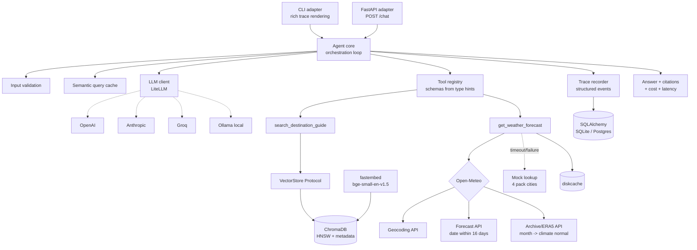

# TripMate — Agentic AI Core: Design Specification

**Date:** 2026-09-16
**Status:** Approved, ready for implementation planning
**Author:** Ankit Singh Chauhan
**Context:** Technical assessment — AI Agent Developer / GenAI Backend Developer (Bitcot)

---

## 1. Objective

Build the agentic core of **TripMate**, a travel assistant that answers natural-language
questions about four destinations (Tokyo, Reykjavik, Bangkok, Barcelona) covering visa
requirements, weather, packing advice, safety, and local customs.

The agent must dynamically decide which tools to call per query — not follow a fixed script
or keyword router — call them in the right order, synthesize one coherent answer, and emit a
visible reasoning trace.

### Success criteria

| # | Criterion | How it is demonstrated |
|---|---|---|
| 1 | Dynamic per-query tool selection | LLM function-calling; `tests/test_tool_selection.py`; eval harness accuracy score |
| 2 | RAG over the destination pack | `search_destination_guide` over ChromaDB; RAGAS context-precision score |
| 3 | Weather tool | `get_weather_forecast` over Open-Meteo with mock fallback |
| 4 | Multi-tool reasoning | Packing queries chain both tools; `tests/test_integration_multitool.py` |
| 5 | Scope awareness | Out-of-scope requests refused explicitly, never fabricated |
| 6 | Visible reasoning trace | Structured trace events rendered live; committed replayable JSONL |

### Grading lens

Two documents define the bar. The assessment brief is the stated rubric; the **Python AI
Engineer job description is the real one**. The JD names: FastAPI/REST, LangChain/LangGraph,
vector databases, PostgreSQL, Docker, unit testing, logging, OOP, clean code. Design
decisions below deliberately cover those bullets where the cost is low, because that is
what the reviewer is hiring against.

The brief also states: *"We are not evaluating production-readiness, UI polish, or lines of
code — a small, clean, well-reasoned solution is valued far more than a large one."* This
spec therefore optimizes for **depth on graded axes, not breadth of features**. Section 15
lists what is deliberately excluded and why.

---

## 2. Locked decisions

| # | Decision | Choice | Rationale | Rejected |
|---|---|---|---|---|
| D1 | LLM provider | **LiteLLM**, provider set by env | User picks any model: OpenAI, Anthropic, Gemini, Groq, Ollama. One dependency normalizes tool-call schemas across all of them. | Hand-rolled per-provider adapters — LiteLLM already does this |
| D2 | Orchestration | **Raw function-calling loop** (~90 lines) | Every line is explainable on video; the reasoning trace is ours to emit; no framework lock-in; the flow is one loop with one branch | LangChain (heavy, trace buried in callbacks); LangGraph (state-graph machinery for a non-branchy flow) |
| D3 | Vector store | **ChromaDB (persistent)** behind a `VectorStore` Protocol | Metadata pre-filtering by city is *required* at scale and cannot be bolted on later without reshaping the tool signature. HNSW index — identical code path at 20 or 200k chunks | numpy cosine (no metadata filter); FAISS (no metadata/persistence ergonomics); pgvector (infra for a take-home) |
| D4 | Embeddings | **`fastembed`** (`BAAI/bge-small-en-v1.5`, ONNX) | ~50MB, no PyTorch. Local and keyless — preserves D1's promise that Ollama alone is sufficient | `sentence-transformers` (drags in ~800MB torch); OpenAI embeddings (couples RAG to one provider, breaks D1) |
| D5 | Weather | **Open-Meteo dual-path** + disk cache + mock fallback | Forecast APIs reach 16 days; the grading query ("packing for Tokyo in December") needs a **climate normal**. Geocoding resolves any city on earth | Forecast-only (fails Module 4); pure mock table (dies past 4 cities) |
| D6 | Differentiators | Tier 1 + Tier 2 (§13, §12) | Eval harness, citations, semantic cache, parallel dispatch, cost accounting, multi-turn | Tier 3 padding — see §15 |
| D7 | API layer | **FastAPI**, thin adapter over the same `Agent` | Largest single JD bullet. ~50 lines. Mirrors SuperDialog's adapter pattern | Flask (JD accepts either; FastAPI is async-native and self-documenting) |
| D8 | Container | **Multi-stage Dockerfile** | JD names Docker; makes the resume's multi-stage-build claim demonstrable | docker-compose stack, k8s manifests — padding here |
| D9 | Persistence | **SQLAlchemy over SQLite, Postgres-ready** | Sessions and traces persisted; `DATABASE_URL` swaps to Postgres with no code change. Zero reviewer setup | Required Postgres (reviewer friction); in-memory (leaves a JD bullet untouched) |

### On not using LangGraph

The JD names "basic LangGraph workflows," so this must be answered explicitly rather than
left as an apparent gap. The README will state:

> This flow is a single loop with one branch. LangGraph's state-graph machinery would add a
> dependency and a layer of indirection without removing code we would otherwise write.
> Where it *would* earn its place: human-in-the-loop interrupts, checkpointed long-running
> workflows, branching multi-agent handoff. The tool registry is framework-agnostic, so the
> tools port to LangGraph unchanged if the flow later becomes branchy.

Justifying the decision scores against brief criterion #4 ("make appropriate technical
decisions and justify them") more strongly than adopting the framework by default.

---

## 3. Architecture



### Request flow

```
query
  |
  1. validate at boundary ......... empty / >2000 chars / non-text -> reject, zero LLM spend
  2. semantic cache probe ......... cosine >= 0.95 vs past queries -> replay, emit CACHE_HIT
  3. LLM call  <---------------+ ... messages = system + history + user
  |    tool schemas from registry (auto-derived from type hints)
  4. tool_calls returned?      |
  |    a. validate args (per-tool pydantic model)
  |    b. dispatch in PARALLEL (ThreadPoolExecutor) - independent tools overlap
  |    c. each: timeout -> retry x1 -> fallback; never raises into the loop
  |    d. append tool results --+ ... max MAX_TOOL_ITERATIONS, then force-synthesize
  5. final answer
       + citations [tokyo/PACKING TIPS]
       + citation validation (strip any not present in retrieved chunk ids)
       + trace footer: tools used | latency | tokens | cost USD
```

The loop is provider-agnostic. The identical code path runs against GPT-4o-mini, Claude,
Llama-3.3 on Groq, or local Qwen — LiteLLM normalizes the tool-call response shape.

---

## 4. Module structure

```
tripmate/
├── README.md                       # primary scoring artifact
├── pyproject.toml                  # uv-managed
├── Dockerfile                      # multi-stage
├── .env.example
├── docs/
│   ├── architecture.md             # mermaid diagram, renders on GitHub
│   └── superpowers/specs/          # this document
├── data/destinations/*.txt         # the 4 provided city guides
├── traces/                         # committed replayable JSONL runs (deliverable)
├── evals/
│   ├── dataset.yaml                # ~30 queries + expected tools + assertions
│   ├── deterministic.py            # tool selection, citations, refusals
│   ├── ragas_eval.py               # faithfulness, answer relevancy, context precision/recall
│   ├── simulation.py               # LLM-simulated traveler, 3-turn conversations
│   └── run_evals.py                # orchestrates all three, prints rich report
├── tests/                          # see §12
└── src/tripmate/
    ├── config.py                   # pydantic-settings, validated at startup
    ├── models.py                   # Chunk, WeatherReport, ToolResult, TraceEvent, Citation
    ├── db.py                       # SQLAlchemy engine, Session/Turn/TraceRecord tables
    ├── core/
    │   ├── agent.py                # the orchestration loop  (~90 lines)
    │   ├── prompts.py              # versioned system prompt
    │   ├── trace.py                # structured events, cost/latency accounting
    │   └── cache.py                # semantic query cache
    ├── llm/client.py               # LiteLLM wrapper: retries, token + cost extraction
    ├── tools/
    │   ├── registry.py             # @tool decorator -> JSON schema from type hints
    │   ├── destination.py          # search_destination_guide
    │   └── weather.py              # get_weather_forecast
    ├── rag/
    │   ├── chunker.py              # section-aware splitting
    │   ├── store.py                # VectorStore Protocol + ChromaStore
    │   └── ingest.py               # idempotent ingest command
    └── adapters/
        ├── cli.py                  # REPL, multi-turn, rich live trace
        └── api.py                  # FastAPI routes
```

Target: ~900 lines across ~20 files, none exceeding ~120 lines. Matches the project coding
standard (many small files, high cohesion, low coupling).

---

## 5. Component contracts

### 5.1 Tool registry — `tools/registry.py`

A `@tool` decorator derives the OpenAI-format function schema from Python type hints and
`Annotated` metadata. There is no hand-written JSON schema anywhere in the codebase, so a
signature and its schema cannot drift.

```python
@tool
def get_weather_forecast(
    city: Annotated[str, "City name, e.g. 'Tokyo'"],
    date_or_month: Annotated[str, "ISO date '2026-12-25' or month name 'December'"],
) -> WeatherReport:
    """Get expected weather for a city on a date or during a month."""
```

Registry responsibilities:
- `schemas() -> list[dict]` — all tool schemas for the LLM request
- `dispatch(name, raw_args) -> ToolResult` — validate args against the derived pydantic
  model, execute, wrap failures as structured results
- Unknown tool name returns a structured error rather than raising

**Scale hook:** `schemas()` is the single seam where semantic tool routing would be added
(embed tool descriptions, send the top-K instead of all N) once tool count grows. Not
implemented — noted in the README's scalability section.

### 5.2 Vector store — `rag/store.py`

```python
class VectorStore(Protocol):
    def add(self, chunks: list[Chunk]) -> None: ...
    def search(
        self, query: str, k: int, city: str | None = None, min_score: float = 0.25
    ) -> list[Chunk]: ...
```

One Protocol, one implementation (`ChromaStore`). The Protocol is the future-proofing; a
second implementation today would be speculative generality.

- **Chunking:** one chunk per document section (5 sections x 4 cities = 20 chunks). City
  name is prefixed into the chunk text *and* stored as metadata. No overlap needed — the
  sections are already semantically self-contained.
- **Chunk ID:** `sha256(city + section + text)[:16]`. Ingest is idempotent — re-running only
  embeds content that actually changed.
- **Metadata:** `{city, section, source_file}`. Enables `where={"city": "tokyo"}` pre-filter.
- **Score floor:** `min_score` — below it, return empty. This is what makes "unknown
  destination" return *nothing* rather than the nearest semantically-adjacent garbage.
  Note: Chroma returns **cosine distance**, not similarity. `ChromaStore.search` converts
  with `similarity = 1 - distance` before comparing against `min_score`, so `min_score` is
  always expressed as a similarity in `[0, 1]`. The `0.25` default is a starting value to be
  tuned against the eval dataset, not a fixed constant.

### 5.3 Destination tool — `tools/destination.py`

```python
search_destination_guide(query: str, city: str | None = None) -> list[Chunk]
```

The LLM extracts `city` from the user's question; Chroma pre-filters on it. At 20 chunks
this is a minor precision win; at 20k chunks it is the difference between working and
broken (without it, "visa rules for Tokyo" scores Seoul and Osaka visa sections nearly as
highly).

Empty result returns `ToolResult(status="no_data", reason="no guide for <city>",
available_cities=[...])` so the agent can state the gap precisely.

### 5.4 Weather tool — `tools/weather.py`

```
city -> geocoding-api.open-meteo.com/v1/search  -> lat/lon      (any city on earth)
           |
   date within 16 days? --yes--> api.open-meteo.com/v1/forecast        -> real forecast
           |
           +--no (month, or far date)--> archive-api.open-meteo.com/v1/archive
                                         same month, last 5 years, averaged
                                         -> climate normal
```

Consistent schema on every path, with the provenance labeled so the agent can never
misrepresent what it knows:

```python
{
  "city": "Tokyo",
  "period": "December",
  "source": "climate_normal",     # "forecast" | "climate_normal" | "mock_fallback"
  "conditions": "cold, dry, mostly clear",
  "temp_range_c": [3, 12],
  "precip_days": 4,
}
```

- **Caching:** climate normals for a city+month never change — cached permanently via
  `diskcache`, keyed `normal:{city}:{month}`. Forecasts get a 1-hour TTL. This is the
  implemented answer to the brief's "avoid redundant tool calls" discussion question.
- **Failure path:** `WEATHER_TIMEOUT_S` timeout, one retry with backoff, then the mock
  lookup table for the four pack cities. The trace shows `source: mock_fallback` — the
  degradation is visible, never silent.
- **Deliberate asymmetry:** geocoding resolves any city, but the guide covers four. Asking
  about Paris yields weather but no guide. Correct behavior is a partial answer that states
  the gap plainly. This is an explicit test case, not an accident.

### 5.5 Agent core — `core/agent.py`

```python
class Agent:
    def __init__(self, llm: LLMClient, registry: ToolRegistry,
                 cache: SemanticCache, tracer: Tracer) -> None: ...
    def chat(self, query: str, session_id: str | None = None) -> AgentResponse: ...
```

Dependencies injected — the tests substitute a `FakeLLMClient` with no other changes.

`AgentResponse`: `answer`, `citations`, `trace`, `tokens`, `cost_usd`, `latency_ms`,
`session_id`.

Loop invariants:
- Never exceeds `MAX_TOOL_ITERATIONS`; on hitting the ceiling it force-synthesizes from
  whatever tool output exists rather than looping or erroring.
- Tool exceptions never enter LLM context as raw tracebacks — they become structured
  `ToolResult(status="error", ...)`. An exception reaching the model is how agents
  hallucinate recovery.
- Independent tool calls in one turn dispatch concurrently via `ThreadPoolExecutor`.

### 5.6 Semantic cache — `core/cache.py`

Embeds the incoming query with the same `fastembed` model, compares against prior query
embeddings, and on cosine >= `SEMANTIC_CACHE_THRESHOLD` replays the stored answer. Persisted
to the database alongside sessions. Cache hits are emitted as trace events, so the saving is
visible during the demo.

### 5.7 Citations

Every retrieved chunk carries a stable ID, `{city}/{SECTION}`. The system prompt requires
claims sourced from the guide to be cited in that form. After generation, a deterministic
validator checks each citation against the IDs actually retrieved this turn; unmatched
citations are stripped and logged as a groundedness warning.

This makes the anti-fabrication requirement **auditable rather than merely requested**, and
supplies a deterministic groundedness signal for the eval harness.

---

## 6. Error handling

Every scenario named in the brief maps to a mechanism and a test named after it.

| Scenario | Mechanism | Agent behavior |
|---|---|---|
| Unknown / unsupported destination | RAG `min_score` floor returns empty | "I don't have a guide for Paris. I cover Tokyo, Reykjavik, Bangkok, Barcelona." |
| Missing / incomplete weather data | Geocode miss or archive gap -> `status: no_data` + reason | States the gap, answers whatever else it can |
| Ambiguous query | System prompt rule: ask, never guess | Returns a clarifying question, zero tool calls |
| Tool failure or timeout | Timeout, one retry with backoff, then fallback | Answers; trace shows `source: mock_fallback` |
| Out-of-scope request | No matching tool + explicit prompt rule | "I can't book flights. Here's what I can help with." |
| Malformed or empty input | Validated at the adapter boundary, pre-LLM | Immediate clear rejection, zero token spend |

**Governing rule: tools return structured failure; they never raise into the loop.**

---

## 7. Configuration

All configuration is environment-driven and validated at startup by `pydantic-settings`.
Missing or invalid values fail immediately with a clear message rather than mid-query. No
secret is ever hardcoded.

```bash
# --- LLM (any provider) ---
LLM_MODEL=gpt-4o-mini              # anthropic/claude-haiku-4-5 | groq/llama-3.3-70b-versatile | ollama/qwen3.5
LLM_API_KEY=                       # unset for ollama
LLM_BASE_URL=                      # optional, e.g. http://localhost:11434
LLM_TEMPERATURE=0.2                # low: tool calling wants determinism
LLM_TIMEOUT_S=30

# --- RAG ---
EMBEDDING_MODEL=BAAI/bge-small-en-v1.5
CHROMA_PATH=./.chroma
RAG_TOP_K=4
RAG_MIN_SCORE=0.25

# --- Agent ---
MAX_TOOL_ITERATIONS=5
MAX_QUERY_CHARS=2000
SEMANTIC_CACHE_ENABLED=true
SEMANTIC_CACHE_THRESHOLD=0.95

# --- Weather ---
WEATHER_TIMEOUT_S=3
WEATHER_CACHE_DIR=./.weather_cache
WEATHER_CLIMATE_YEARS=5

# --- Persistence ---
DATABASE_URL=sqlite:///./tripmate.db     # postgresql+psycopg://... in production

# --- Observability ---
LOG_LEVEL=INFO
LOG_FORMAT=rich                    # rich | json
TRACE_DIR=./traces
```

**Key handling:** LiteLLM reads provider-specific environment variables
(`OPENAI_API_KEY`, `ANTHROPIC_API_KEY`, `GROQ_API_KEY`, ...). `config.py` owns this
mapping: it derives the provider from the `LLM_MODEL` prefix and exports `LLM_API_KEY` to
the correct variable at startup. Users therefore set one key regardless of provider, and
a provider that needs no key (Ollama) skips the check. Startup validation fails fast with a
named error if a key is required but absent.

---

## 8. Logging and tracing

`structlog`, dual-sink: `rich` rendering to console for the demo, JSON lines to file for
machines.

`TraceEvent` types: `QUERY_RECEIVED`, `CACHE_HIT`, `LLM_CALL`, `TOOL_CALL`, `TOOL_RESULT`,
`TOOL_ERROR`, `FALLBACK_USED`, `CITATION_REJECTED`, `ANSWER_SYNTHESIZED`.

Each event carries `session_id`, `turn_id`, monotonic sequence number, timestamp, duration,
and an event-specific payload.

**Event-sourced and replayable.** Traces are append-only JSONL, one file per session. A
`replay` command reconstructs a session offline from its log — the same event-sourcing
approach used in SuperDialog's Director replay. This makes the "example trace logs"
deliverable an engineering artifact rather than a text dump, and it is what makes eval runs
auditable after the fact.

---

## 9. Persistence

SQLAlchemy 2.0 ORM over SQLite, with `DATABASE_URL` switching to PostgreSQL with no code
change. Connection pooling configured explicitly (`pool_size`, `max_overflow`,
`pool_pre_ping`).

| Table | Purpose |
|---|---|
| `sessions` | id, created_at, last_active_at |
| `turns` | session_id FK, role, content, tokens, cost_usd, latency_ms |
| `trace_records` | turn_id FK, seq, event_type, payload JSON |
| `query_cache` | query_text, embedding BLOB, answer, citations, created_at |

---

## 10. Adapters

Both adapters are thin shells over a single `Agent`. The runtime does not know what is
calling it — the same separation SuperDialog uses across its LiveKit / PipeCat / FastAPI /
WebSocket / CLI hosts.

### CLI — `adapters/cli.py`
Multi-turn REPL with live `rich` trace rendering: tool calls, arguments, timings, cache
hits, and a per-turn footer of tokens, cost, and latency. Commands: `/trace`, `/cost`,
`/reset`, `/quit`.

### FastAPI — `adapters/api.py`

| Route | Behavior |
|---|---|
| `POST /chat` | `{query, session_id?}` -> `{answer, citations, trace, tokens, cost_usd, latency_ms, session_id}` |
| `GET /health` | provider reachable, chroma loaded, chunk count, db connected |
| `GET /sessions/{id}` | conversation history with per-turn traces |

Pydantic request/response models; validation errors rejected at the boundary with 422.

---

## 11. System prompt design

Versioned in `core/prompts.py`, not inlined as f-strings. Structure:

1. **Role** — TripMate, a travel assistant for four specific destinations
2. **Capabilities** — exactly what the two tools can and cannot do
3. **Tool policy** — call the guide for visa/customs/safety/packing; call weather for
   conditions; call **both** for packing questions, because good packing advice depends on
   both the guide's tips and the actual season
4. **Citation rule** — cite `[city/SECTION]` for every claim drawn from the guide
5. **Refusal rule** — for bookings, reservations, payments, or unrelated topics: state the
   limitation plainly and never simulate the action
6. **Ambiguity rule** — when the destination or timeframe is unclear, ask; do not guess
7. **Grounding rule** — never state a fact that no tool returned; if data is missing, say so

---

## 12. Testing

The enabling decision is a **`FakeLLMClient`** that replays canned tool-call sequences.
Tool-selection and integration tests therefore run deterministically in CI: no API key, no
network, no cost, no flake.

| File | Covers |
|---|---|
| `test_registry.py` | schema derivation from type hints; arg validation; unknown-tool handling |
| `test_tools_destination.py` | retrieval relevance, city metadata filter, score floor, empty result |
| `test_tools_weather.py` | forecast path, climate-normal path, geocode miss, timeout -> fallback (HTTP mocked with `respx`) |
| `test_tool_selection.py` | single-tool, multi-tool, and no-tool routing (fake LLM) |
| `test_error_scenarios.py` | all six §6 rows, each test named for its brief bullet |
| `test_integration_multitool.py` | full packing flow end-to-end: real tools, real Chroma, fake LLM |

Also covered: input validation boundaries, citation validator (rejects hallucinated IDs),
semantic cache hit/miss threshold behavior, idempotent re-ingest.

Target: 80%+ line coverage, reported via `pytest-cov`.

---

## 13. Evaluation harness

The layer that most separates this submission. The job title is *AI Agent Developer* —
agents fail **probabilistically**, so functional tests alone are insufficient. Structure
mirrors the deterministic-plus-judge split already used in SuperDialog.

### Layer 1 — Deterministic (`evals/deterministic.py`)
No LLM judging. Exact assertions over `evals/dataset.yaml` (~30 queries):
- **Tool-selection accuracy** — did the agent call exactly the expected tool set?
- **Citation validity** — does every citation map to a chunk actually retrieved?
- **Refusal correctness** — did out-of-scope queries get refused and in-scope ones not?
- **Latency and cost** — p50/p95 per query.

### Layer 2 — RAGAS (`evals/ragas_eval.py`)
Industry-standard RAG metrics over the same dataset: `faithfulness`, `answer_relevancy`,
`context_precision`, `context_recall`. Opt-in (requires an LLM key), marked slow.

### Layer 3 — Simulated user (`evals/simulation.py`)
An LLM plays a traveler across scripted 3-turn conversations (e.g. *"Going to Tokyo in
December"* -> *"What should I pack?"* -> *"And what about Bangkok instead?"*), scored on
goal completion and context retention. Agent simulation, carried over from SuperDialog.

### Dataset shape

```yaml
- id: multi_tool_packing
  query: "What should I pack for Tokyo in December?"
  expected_tools: [search_destination_guide, get_weather_forecast]
  must_mention: ["layers", "warm"]
  must_cite: ["tokyo/PACKING TIPS"]

- id: out_of_scope_booking
  query: "Can you book my flight to Barcelona?"
  expected_tools: []
  must_refuse: true
  must_not_mention: ["booked", "confirmed", "reservation number"]
```

`run_evals.py` runs all three layers and prints a `rich` scorecard.

---

## 14. Deliverables

| Deliverable | Where |
|---|---|
| GitHub repository | public repo |
| README — setup, architecture, tool schemas, 4 example traces, design decisions, limitations, future work, scalability answers | `README.md` |
| Architecture diagram | `docs/architecture.md` (mermaid, renders inline on GitHub) |
| Data pack ingested | `data/destinations/`, `rag/ingest.py` |
| Test cases | `tests/` |
| Example trace logs | `traces/*.jsonl` — real captured runs |
| Loom video (5–8 min) | recorded after implementation |

### README example runs (required: >=1 multi-tool, >=1 out-of-scope)
1. **Single tool, RAG** — "Do I need a visa for Japan?"
2. **Single tool, weather** — "How cold is Reykjavik in January?"
3. **Multi-tool chained** — "What should I pack for Tokyo in December?"
4. **Out of scope** — "Can you book my flight?"
5. **Failure path** — weather API unreachable, fallback visible in trace

### Loom outline
Overview -> architecture walkthrough -> live demo (single / multi / out-of-scope /
**deliberate failure with network disabled**) -> code walkthrough (registry, agent loop) ->
technical decisions (including why not LangGraph) -> **live provider swap** (same query on
OpenAI then Ollama) -> limitations and future work.

The deliberate induced failure is the most memorable thirty seconds available and is
something almost no submission includes.

---

## 15. Deliberately out of scope

Listed in the README with reasons. Naming them demonstrates the judgment the brief grades;
silence reads as not having considered them.

| Excluded | Why |
|---|---|
| Web UI | Brief explicitly excludes UI polish from grading |
| docker-compose / k8s manifests | One Dockerfile proves the competence; the rest is padding |
| User auth / multi-tenancy | No user model in the problem statement |
| LangSmith / external tracing SaaS | Local structured tracing is sufficient and dependency-free |
| Multi-agent crew | One agent with two tools; more agents would be architecture theater |
| Token streaming | Adds transport complexity; the trace is what needs to be visible here |
| Reranking | Meaningful past a few thousand chunks; noted as a scale path instead |

---

## 16. Scalability (README discussion section)

**RAG from 4 cities to several hundred.** 4 cities and 4,000 cities run *identical code
paths*. 400 cities is ~2,000 chunks; 4,000 is ~20,000 — well within Chroma's HNSW index.
What changes: (a) config, swapping the persistent client for a Chroma server or pgvector
behind the same `VectorStore` Protocol; (b) ingest becomes a batch job, already idempotent
via content hashing. The real bottleneck at that size is **retrieval precision, not speed** —
semantic search over 20k chunks returns Seoul's visa section for a Tokyo query. The
city-metadata pre-filter already in the tool signature is the mitigation; reranking is the
next step after that.

**Avoiding redundant tool and LLM calls.** Implemented, not hypothetical: a semantic query
cache (cosine >= 0.95 replays a stored answer) plus permanent disk caching of climate
normals, which never change. Next step at volume: a shared Redis cache so the hit rate is
cross-process rather than per-instance.

**Reducing LLM cost at higher volume.** Tiered routing — a small model handles tool
selection while a stronger one handles synthesis only when needed (the Talker/Director split
from SuperDialog). Prompt caching for the static system prompt. Trimming tool schemas sent
per request. Batching evals offline rather than live. Per-query cost is already measured, so
any optimization is verifiable rather than assumed.

**Keeping tool-selection latency low as tools grow.** At ~10 tools, send all schemas. Past
that, embed tool descriptions and send only the top-K most relevant to the query — the
registry's `schemas()` method is the single seam where this plugs in. Beyond ~50 tools,
hierarchical routing: pick a tool *category* first, then a tool within it.

---

## 17. Known limitations

- The destination pack is a simplified reference dataset, not authoritative travel or visa
  advice. The agent states this.
- Climate normals are five-year ERA5 averages — an indication of typical conditions, not a
  forecast. The response labels its own provenance.
- Retrieved guide text is treated as trusted. A production system ingesting third-party
  content would need prompt-injection defenses on retrieved chunks.
- The semantic cache is per-process. Multi-instance deployment needs shared cache storage.
- Multi-turn history is unbounded within a session; a long conversation would eventually
  need summarization or windowing.
- Evaluation dataset is ~30 queries, hand-authored — enough to catch regressions, not enough
  for statistical confidence.

---

## 18. Future improvements

1. Reranking stage (retrieve top-20, rerank to top-4) once the corpus exceeds a few thousand chunks
2. Hybrid search (BM25 + dense) for exact terms like visa category codes
3. Query rewriting for multi-hop questions ("compare Tokyo and Bangkok in July")
4. Redis-backed shared semantic cache for horizontal scaling
5. Tiered model routing — cheap selection, strong synthesis
6. Streaming token output for perceived latency
7. OpenTelemetry export — the trace event model already fits the span shape
8. Conversation summarization for long sessions

---

## 19. Dependencies

| Package | Purpose |
|---|---|
| `litellm` | provider-agnostic LLM + tool calling |
| `chromadb` | vector store with metadata filtering |
| `fastembed` | ONNX embeddings, no PyTorch |
| `pydantic`, `pydantic-settings` | models, schema derivation, config validation |
| `sqlalchemy` | persistence, Postgres-ready |
| `fastapi`, `uvicorn` | HTTP adapter |
| `httpx` | Open-Meteo calls with timeouts |
| `diskcache` | weather response caching |
| `structlog`, `rich` | structured logging, trace rendering |
| `pyyaml` | eval dataset |
| `pytest`, `pytest-cov`, `respx` | testing |
| `ragas` | RAG metrics (eval extra, optional install) |

Python 3.10+, managed with `uv`.
