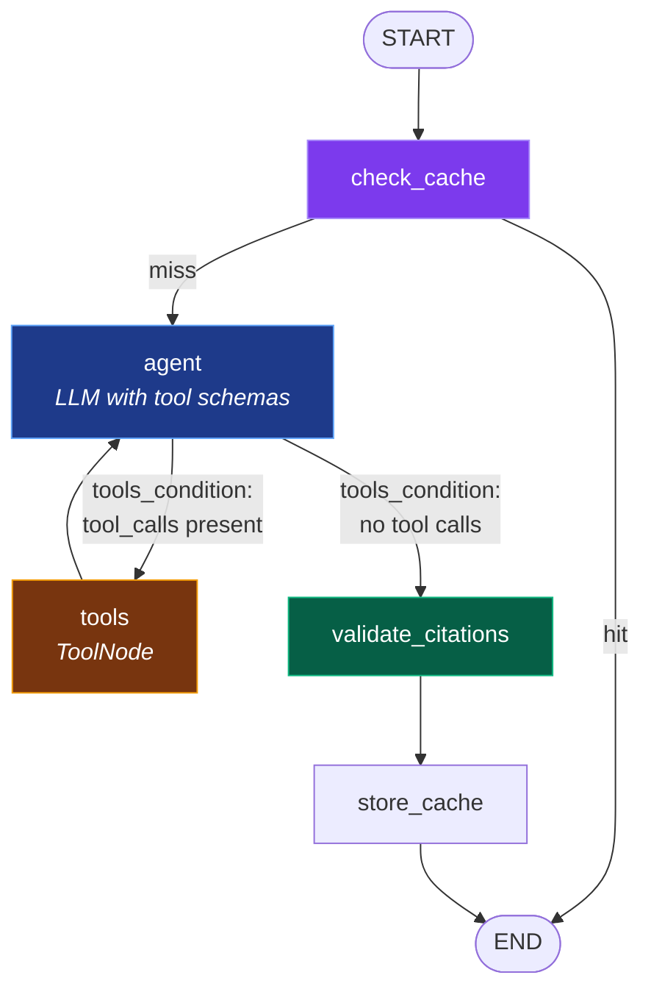

# TripMate — LangGraph Orchestration: Design Specification

**Date:** 2026-09-17
**Status:** Approved, implementing
**Supersedes:** the raw function-calling loop in `core/agent.py` from
`docs/superpowers/specs/2026-09-16-tripmate-agent-design.md` (decision D2)

---

## 1. Why this exists

Round-1 feedback asked for "a framework-based agentic workflow", explicitly
"beyond a custom implementation". The assessment brief was also edited between rounds:

```diff
- LangChain, LangGraph, CrewAI, a raw OpenAI/Anthropic function-calling loop,
-   or your own custom orchestration.
+ LangChain, LangGraph, CrewAI, OpenAI/Anthropic SDK.
```

Custom orchestration was removed as an option. The raw loop is therefore replaced, not
defended. The prior implementation remains in git history and is cited in the README
with its eval numbers, so the comparison survives as evidence rather than as code.

The reviewer named four things to demonstrate: **agent, skills/tools, state, and
workflow**. "State" is LangGraph's central abstraction, which is what makes LangGraph —
rather than LangChain's `AgentExecutor` or CrewAI — the right fit here.

## 2. What does not change

The registry was built framework-agnostic in round 1, and that now pays off. Unchanged:

| Component | Status |
|---|---|
| `tools/registry.py`, `tools/destination.py`, `tools/weather.py`, `tools/openmeteo.py` | unchanged |
| `rag/` (chunker, store, ingest) | unchanged |
| `llm/client.py` | unchanged |
| `core/trace.py`, `core/cache.py`, `core/prompts.py` | unchanged |
| `db.py` | keeps the semantic cache and trace rows; **no longer stores conversation turns** |
| `adapters/cli.py` | unchanged — `Agent.chat()` keeps its signature |
| `evals/` | unchanged — it is the acceptance test for the port |

Replaced: `core/agent.py`'s orchestration internals.
Deleted: `_run_loop`, `_dispatch_all`, `_call_llm`, `_assistant_message`,
`_persist_turns` — roughly 150 lines, replaced by graph structure.

## 3. Graph



Four nodes, two conditional edges.

`tools_condition` is LangGraph's built-in router. **Dynamic tool selection is therefore
a graph primitive rather than an `if` inside a method** — the model's decision to emit
tool calls drives the edge directly.

The semantic cache becomes a routing decision instead of an early return buried in
`chat()`. Its "first turn of a session only" rule becomes an explicit condition on that
edge, which is easier to read and to test than the previous boolean.

## 4. State

```python
class AgentState(TypedDict):
    messages: Annotated[list[AnyMessage], add_messages]
    query: str
    allowed_refs: set[str]
    citations: list[Citation]
    answer: str
    was_cached: bool
```

`add_messages` is LangGraph's reducer: nodes return message *deltas* and the framework
appends them. The previous implementation threaded a mutable `messages` list through
three methods by hand.

`allowed_refs` accumulates the `city/SECTION` ref of every chunk retrieved this turn,
and `validate_citations` strips any citation not in it. Previously a local variable
passed between methods; as graph state it is inspectable at every step.

### Checkpointer

`SqliteSaver` owns conversation history, keyed on `thread_id = session_id`. This
replaces `SessionStore.add_turn` / `history()` entirely: LangGraph reloads prior
messages on each invocation.

Consequence: `db.py` no longer stores turns. It keeps `CacheRow` (semantic cache) and
`TraceRow` (trace events). The `/sessions/{id}` endpoint reads from the checkpointer via
`graph.get_state(config)` rather than from `SessionStore`.

This is a real simplification, not a re-labelling: the bug found in round 1 — where
`history()` was read but never written, leaving multi-turn inert — becomes structurally
impossible, because persistence is the framework's responsibility rather than a call the
agent must remember to make.

## 5. Tool adapter

`ToolNode` expects LangChain tool objects; the registry produces `ToolSpec`s whose
schemas are derived from Python type hints. A thin adapter bridges them:

```python
def to_langchain_tools(registry: ToolRegistry) -> list[StructuredTool]
```

For each `ToolSpec` it builds a `StructuredTool` from the existing `arg_model` and
docstring, wrapping the call so the returned `ToolResult` is serialised with
`json.dumps(result.model_dump(), default=str)` — byte-identical to what the previous
loop put in tool messages. The model therefore sees the same input, and eval numbers
stay comparable across the port.

The registry remains the single source of truth for tool schemas. Neither tool module
changes.

## 6. Nodes

| Node | Reads | Writes | Behaviour |
|---|---|---|---|
| `check_cache` | `query` | `answer`, `citations`, `was_cached` | Semantic lookup, first turn only. Routes to END on hit. |
| `agent` | `messages` | `messages` | Calls the LLM with tool schemas bound. Records `LLM_CALL`. |
| `tools` | `messages` | `messages`, `allowed_refs` | `ToolNode` executes; a post-hook records `TOOL_CALL`/`TOOL_RESULT` and collects refs. |
| `validate_citations` | `messages`, `allowed_refs` | `answer`, `citations` | Strips ungrounded citations, records `CITATION_REJECTED`. |
| `store_cache` | `query`, `answer`, `citations` | — | Writes to the semantic cache, first turn only. |

Each node is a pure function of state, which makes it independently unit-testable — an
improvement over the previous private methods, which could only be reached through
`chat()`.

## 7. Agent facade

`Agent` keeps its public surface so no adapter changes:

```python
class Agent:
    def chat(self, query: str, session_id: str | None = None) -> AgentResponse: ...
    @property
    def registry(self) -> ToolRegistry: ...
    @property
    def settings(self) -> Settings: ...
    @property
    def graph(self): ...        # new: the compiled StateGraph
```

`chat()` validates input, invokes the graph with
`config={"configurable": {"thread_id": session_id}}`, and maps the final state to
`AgentResponse`. Input validation stays *outside* the graph so malformed input still
costs zero LLM calls.

## 8. Error handling

Unchanged in behaviour. Tools still never raise: `ToolRegistry.dispatch` converts every
failure into a `ToolResult`, and the adapter passes that through, so `ToolNode` receives
a value rather than an exception.

The iteration ceiling moves from a `for` loop to the graph's `recursion_limit`
(`max_tool_iterations * 2 + 1`, since each tool round is two node visits). Hitting it
raises `GraphRecursionError`, which `chat()` catches and converts into the existing
`EMPTY_ANSWER_FALLBACK` path.

## 9. Testing

New: one unit test per node (pure functions over state), a graph-compiles-and-routes
test, and an adapter test asserting the generated `StructuredTool` carries the schema
the registry derived.

Existing: behavioural suites — tool selection, the six error scenarios, the integration
flow — should pass unchanged, because `chat()` is stable. Tests asserting on deleted
private methods will be rewritten against nodes instead. Estimated 8-12 of the 26 tests
in `test_agent.py`.

**Acceptance is the eval harness, not the unit tests.** Deterministic, RAGAS and
simulation layers are run before and after; scores should match within the run-to-run
variance already documented. That is a stronger claim than "tests pass", and it produces
the comparison table for the README.

## 10. Known risks

- `SqliteSaver` requires an explicit context manager or a long-lived connection. Getting
  this wrong yields a closed-database error on the second turn. Mitigated by a
  multi-turn test over a real checkpointer file.
- LangGraph serialises state; `set[str]` for `allowed_refs` may need a list. If so it
  becomes `list[str]` with de-duplication in the node.
- `recursion_limit` counts *node visits*, not loop iterations. The conversion above must
  be verified by a test that forces the ceiling.
